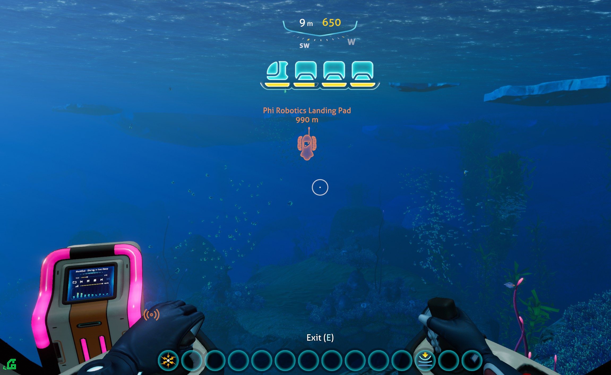
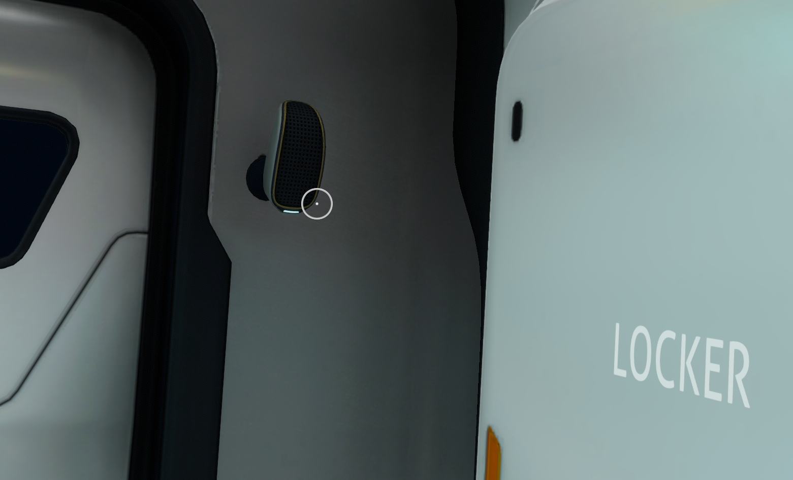
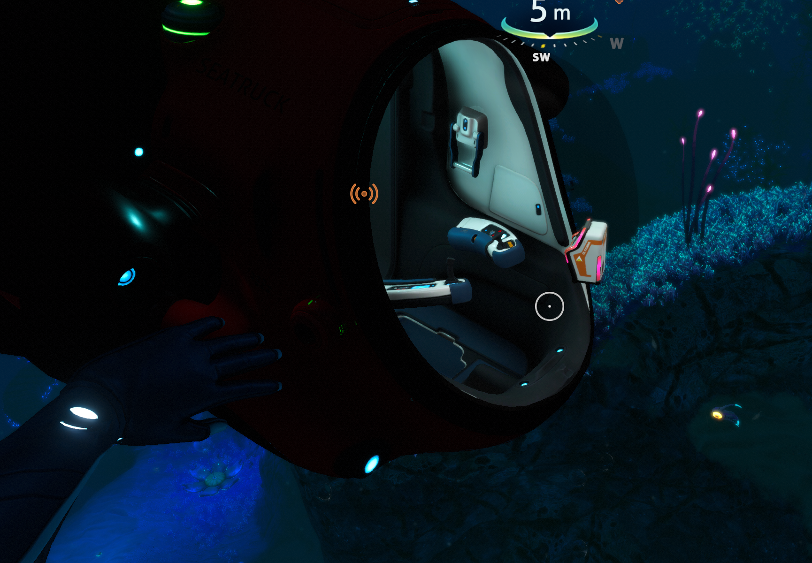
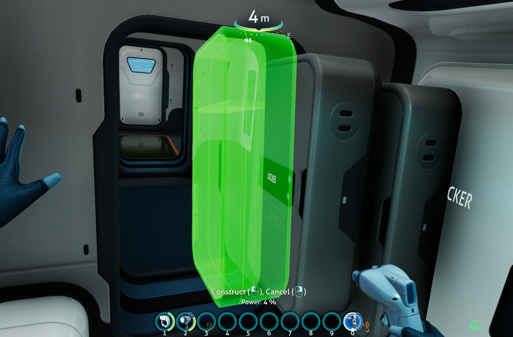
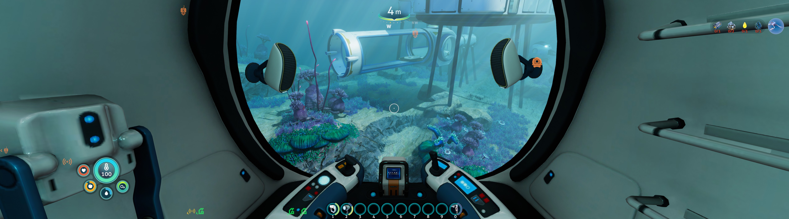

# Build In Seatruck Plus

## AI VIBE CODED PROJECT. CLAUDE CHAT LOG INCLUDED

[](https://github.com/TRusselo/BuildInSeatruckPlus/releases)
[](LICENSE)

**Build inside your Seatruck — and bring the music with you.**

A **Subnautica: Below Zero** mod with two headline features:

- 🛠️ **Build In Seatruck** — use the Habitat Builder to place buildables *inside*
  your Seatruck. Lockers, fabricators, planters, decorations — they ride with the
  vehicle, and detaching/reattaching modules works as expected. This is a BepInEx
  port, **updated for the current game**, of BluesKutya's *Build In Seatruck*.
- 🎵 **Mini Jukebox & Speakers** — compact, Seatruck-sized buildables that play
  the music tracks you've unlocked from Jukebox Disks, plus a hotkey to control
  playback on the move.


---

## Media

| | |
|---|---|
|  |  |
| *Mini Jukebox playing in the cab while you pilot* | *Mini Speaker mounted next to a wall locker* |
|  |  |
| *Build right inside the cab — not just the modules* | *Liberal placement — the ghost goes green inside the cab* |
|  |  |
| *Mini Speakers in the cockpit* | *The native jukebox control UI* |

---

## Features

### 🛠️ Build In Seatruck
- Place buildables inside any Seatruck segment with the Habitat Builder.
- Everything parents to the segment, so it **rides with the Seatruck** as you drive.
- Detach and reattach modules freely — your builds stay put.
- Normal base and world building are completely untouched (the Seatruck handling
  is scoped to when you're actually standing in a Seatruck).

### 🎵 Mini Jukebox & Speakers
- **Mini Jukebox** — a 25%-scale buildable jukebox that fits the Seatruck. Plays
  your unlocked tracks through the game's own jukebox engine, with the normal
  in-world play / pause / next / shuffle / repeat / volume screen.
- **Mini Speaker** — a 50%-scale speaker so the music is clear inside the cramped cab.
- Very liberal placement collision on both, so they're easy to fit.

### ⌨️ Playback hotkey
While inside a Seatruck or base:
- **Hold** the key (default **R**) → start / stop playback.
- **Tap** the key → skip to the next track (with a "Now playing" toast).

### ⚙️ In-game options (Nautilus Mod Options)
Rebind the hotkey, tune long-press timing, cheap recipe, unlock toggle, default
shuffle, and notifications.

---

## Requirements

| Dependency | Notes |
|------------|-------|
| **Subnautica: Below Zero** | Current Steam build |
| **BepInEx** for Below Zero | [Tobey's BepInEx Pack for Subnautica: Below Zero](https://www.nexusmods.com/subnauticabelowzero/mods/344) (BepInEx 5.4.x) |
| **Nautilus** | 1.0.0 or newer — [Nexus](https://www.nexusmods.com/subnautica/mods/1262) / [GitHub releases](https://github.com/SubnauticaModding/Nautilus/releases) |

Nautilus and BepInEx must be installed first. **Nautilus is not on Thunderstore**,
so mod-manager users still have to install it manually into `BepInEx/plugins`
(the manager will pull in the BepInEx pack, but not Nautilus).

---

## Installation

### Manual
1. Install the BepInEx pack and Nautilus (see Requirements).
2. Download `BuildInSeatruckPlus-x.y.z.zip` from the
   [Releases](https://github.com/TRusselo/BuildInSeatruckPlus/releases) page.
3. Extract it so that the file lands at:
   ```
   <game folder>/BepInEx/plugins/BuildInSeatruckPlus/BuildInSeatruckPlus.dll
   ```
4. Launch the game.

### Mod manager (Thunderstore / r2modman)
Install **Nautilus** and this mod; the manager handles dependencies.

---

## Usage

### Building in the Seatruck
Get inside a Seatruck, equip the **Habitat Builder**, and build as you normally
would in a base. The placement ghost turns green inside the cab and attached
modules; whatever you place rides along when you drive.

### The jukebox
1. **Unlock the mini buildables.** By default the Mini Jukebox & Mini Speaker
   unlock alongside the vanilla Jukebox (find Jukebox Disks / scan Jukebox
   fragments). Prefer them from the start? Tick **"Unlock buildables at start"**
   in the mod options and restart.
2. **Build** a Mini Jukebox (and a Mini Speaker or two) in your Seatruck — they
   share the vanilla Jukebox's build-menu category.
3. **Play music:**
   - Walk up and click the jukebox's screen, **or**
   - Use the hotkey: **hold R** to start/stop, **tap R** to skip. Only active
     while you're inside a Seatruck or base.

Songs are the ones you've unlocked from Jukebox Disks — the mod uses the game's
own unlocked-track playlist, so there's nothing extra to manage.

---

## Configuration

Open **Options → Mod Options → Build In Seatruck Plus** in-game. Settings are saved to
`BepInEx/config/com.tristyn.buildinseatruckplus.json`.

| Option | Default | Description |
|--------|---------|-------------|
| Playback hotkey | `R` | Key for play/stop (hold) and next (tap), in Seatruck/base |
| Long-press seconds | `0.50` | How long to hold before it counts as play/stop |
| Cheap recipe | off | Build the mini items for 1 Titanium *(restart required)* |
| Unlock buildables at start | off | Make the mini items available immediately *(restart required)* |
| New jukeboxes start in shuffle | on | Sets shuffle when playback starts via the hotkey |
| Show "Now playing" notifications | on | On-screen track name when a song starts/skips |

---

## Building from source

Requires the .NET SDK and a local install of the game + BepInEx + Nautilus
(the `.csproj` references DLLs by absolute path — adjust the paths at the top of
`BuildInSeatruckPlus.csproj` to your install).

```bash
dotnet build BuildInSeatruckPlus.csproj -c Release
```

The build publicizes `Assembly-CSharp` (via `BepInEx.AssemblyPublicizer.MSBuild`)
and copies the output DLL into `BepInEx/plugins/BuildInSeatruckPlus/`.

To produce release zips:

```bash
./package.sh
```

---

## Credits

- **BluesKutya** — original [*Build In Seatruck*](https://www.nexusmods.com/subnauticabelowzero/mods/287)
  ([source](https://github.com/BluesKutya/SubnauticaMods), MIT). This mod continues
  and updates that build-in-Seatruck functionality for the current game and adds
  the mini jukebox features.
- **SubnauticaModding** — [Nautilus](https://github.com/SubnauticaModding/Nautilus) modding API.
- **Tobey** — [BepInEx Pack for Subnautica: Below Zero](https://www.nexusmods.com/subnauticabelowzero/mods/344).
- **Unknown Worlds** — Subnautica: Below Zero.

## License

[MIT](LICENSE). Includes MIT-licensed portions © 2022 BluesKutya.
