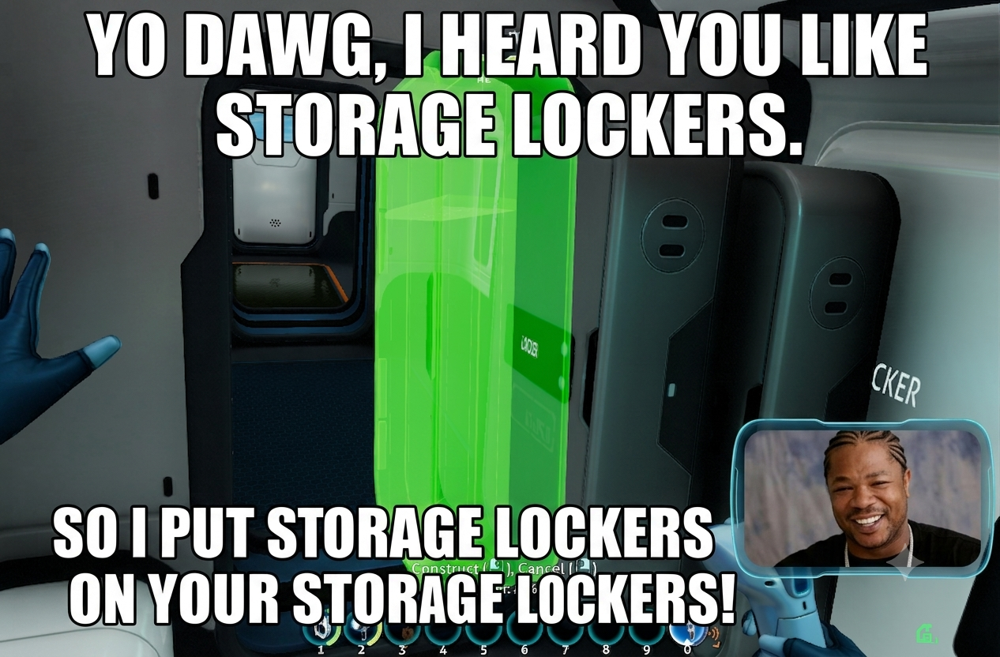

╭─── Claude Code v2.1.181 ─────────────────────────────────────────────────────╮
│                                                    │ Tips for getting        │
│                Welcome back Tristyn!               │ started                 │
│                                                    │ Run /init to create a … │
│                       ▐▛███▜▌                      │ ─────────────────────── │
│                      ▝▜█████▛▘                     │ What's new              │
│                        ▘▘ ▝▝                       │ Added `/config key=val… │
│ Opus 4.8 · Claude Pro · tristynrusselo@gmail.com's │ Added `sandbox.allowAp… │
│ Organization                                       │ Added `CLAUDE_CLIENT_P… │
│  ~/…/share/Steam/steamapps/common/SubnauticaZero   │ /release-notes for more │
╰──────────────────────────────────────────────────────────────────────────────╯

❯ I want to make a mod file for Subnautica: Below Zero                          
                                                                                
  if it needs a framework use BeepinEx / Nautilus                               
                                                                                
                                                                                
                                                                                
  In the game there is a jukebox, and you find and unlock songs through finding 
  items in the game.  unlocking the songs allows you to play those songs at     
  the jukebox you can build at your base.                                       
                                                                                
                                                                                
                                                                                
  I want a mod to play the unlocked songs in the seatruck.  hotkey R longpress  
  to start/stop playback, R shortpress to 'next track'                          

● I'll start by invoking the brainstorming skill, since we're designing a new
  mod feature and I want to nail down the requirements and approach before
  writing code.

● Skill(superpowers:brainstorming)
  ⎿  Successfully loaded skill

● Let me explore the project context first — the working directory is the game
  install.

  Listed 2 directories (ctrl+o to expand)

● BepInEx is installed. Let me check for Nautilus and the existing plugin setup.

  Listed 1 directory, ran 1 shell command (ctrl+o to expand)

● BepInEx + Nautilus + dotnet 10 — solid setup. Let me research how the game's
  jukebox actually works so my design questions are grounded. First, what
  decompiler tooling is available.

  Ran 1 shell command (ctrl+o to expand)

● Let me install a decompiler so I can inspect the jukebox system precisely.

  Ran 1 shell command (ctrl+o to expand)

❯ maybe search online about subnautica BZ modding info. know what you are       
  getting into first?                                                           

● Good call. Let me research the modding landscape and the jukebox system online
  before touching code.

● Web Search("Subnautica Below Zero jukebox how to unlock songs disc data")
  ⎿  Did 1 search in 5s

● Web Search("Subnautica Below Zero modding BepInEx Nautilus jukebox Jukebox
            class code")
  ⎿  Did 1 search in 6s

● There's an existing jukebox mod (Spotify integration) on GitHub — that's gold
  for understanding the Jukebox API. Let me examine it.

● Fetch(https://github.com/hugocowan/SubnauticaJukeboxMod)
  ⎿  Received 263.4KB (200 OK)

● Web Search("Subnautica Below Zero Jukebox class Play Track UnlockTrack code
            Assembly-CSharp")
  ⎿  Did 1 search in 6s

● The summary missed the code. Let me pull the actual source via the GitHub API
  to learn the real Jukebox API.

  Ran 1 shell command (ctrl+o to expand)

● Fish is globbing the ?. Let me quote it.

  Ran 3 shell commands (ctrl+o to expand)
● Let me use the GitHub MCP tools instead.

● Fetch(https://raw.githubusercontent.com/hugocowan/SubnauticaJukeboxMod/47c080e
       d9ec526d7acffb9e1b8573c5055be41ad/Patches/JukeboxPatcher.cs)
  ⎿  Received 15.9KB (200 OK)

● Fetch(https://raw.githubusercontent.com/hugocowan/SubnauticaJukeboxMod/47c080e
       d9ec526d7acffb9e1b8573c5055be41ad/Patches/MusicManagerPatcher.cs)
  ⎿  Received 826 bytes (200 OK)

● I've now got a solid picture. Here's what I've learned:

  Modding stack (all present & ready): BepInEx + Nautilus + Harmony are
  installed, and dotnet 10 is available to build against. Plenty of
  Nautilus/Seatruck mods already in your plugins/ folder confirm the setup
  works.

  How the jukebox actually works (from the game's Jukebox class, confirmed via 
  an existing jukebox mod's Harmony patches):
  - There's a single global playback engine — Jukebox.main — that streams the
  disc audio through FMOD. It exposes Play(), Stop(), GetNext(), plus volume,
  position, _file, _playlist, soundPosition, etc.
  - The physical buildable jukebox (JukeboxInstance) is just a remote control
  that drives Jukebox.main. This is the key win: I can drive playback from the
  Seatruck without any physical jukebox, reusing the game's own audio engine,
  volume slider, and unlocked-track data — rather than bolting on a separate
  audio player.
  - Unlocked songs come from picking up Jukebox Disks, stored in a global
  unlocked-tracks collection I can enumerate.

  So the mod is very feasible: a small BepInEx/Nautilus plugin that watches for
  R while you're in the Seatruck and calls into Jukebox.main, treating the
  unlocked tracks as a playlist.

  Before I write the design doc, a few decisions that change the behavior. (One
  note: I'll need to confirm the exact Jukebox/unlock member names by
  decompiling Assembly-CSharp.dll during implementation — that's why I tried
  installing a decompiler earlier. I'll ask how you'd like me to handle that
  too.)

● User answered Claude's questions:
  ⎿  · When you leave the Seatruck (exit the pilot seat / step out), what should
     the music do? → Stop on exit
     · How should the unlocked songs be ordered when playing / hitting 'next'? →
     Configurable (default shuffle)
     · Should the mod show on-screen feedback (a notification/subtitle with the 
     track name) when a song starts or you skip? → Yes, show track name
     · I need exact member names from the game's Jukebox/unlock code. How should
     I get them? (decompiling your local Assembly-CSharp.dll) → Local tool 
     manifest

● Good — decisions locked: stop on exit, configurable order (default shuffle),
  show track name, local tool manifest for decompiling.

  Let me now actually decompile the Jukebox and disk/unlock classes to confirm
  exact member names — grounding the design in real APIs. I'll do this in a
  scratch workspace (not scaffolding the mod yet).

  Ran 1 shell command (ctrl+o to expand)

❯ all hotkeys configurable in mod settings                                      

● ilspycmd works. Noted on all hotkeys configurable in mod settings — I'll bake
  that in. Let me decompile the relevant classes now.

  Ran 2 shell commands (ctrl+o to expand)

● Now I understand the API. The crucial detail: Jukebox.Play(JukeboxInstance 
  instance) and GetNext(JukeboxInstance, bool) both need a JukeboxInstance — the
  buildable controller. The playlist (_playlist) is already auto-built from
  Player.main.unlockedTracks, so unlocked songs are handled for me. Let me
  decompile JukeboxInstance to see what it needs to function — this determines
  how I host one in the Seatruck.

  Ran 1 shell command (ctrl+o to expand)

❯ continue                                                                      

  Ran 1 shell command (ctrl+o to expand)

❯ seems to be failing?                                                          

● Those weren't command failures — that message appears when the tool call gets
  declined at the permission prompt (it was rejected before running, so nothing
  executed). The earlier decompile of Jukebox worked fine; this was the same
  kind of command for JukeboxInstance.

  Possibly the long grep pattern looked alarming. Let me split it into two
  simple, obvious steps — first just decompile to a file, nothing else:

  Ran 1 shell command (ctrl+o to expand)

● That worked. Now let me read the key parts of it.

  Read 1 file (ctrl+o to expand)

● JukeboxInstance is heavily UI-bound (canvas, TextMeshPro, Images, all
  [AssertNotNull]). Creating one from scratch could be painful. The feasibility
  hinges on what the engine actually reads from the instance during playback,
  and what JukeboxInstance's lifecycle methods dereference. Let me look at its
  methods and the playback path.

  Read 1 file, ran 1 shell command (ctrl+o to expand)
● Confirmed: a raw JukeboxInstance is deeply UI-wired (Start/OnEnable
  dereference canvas, imagePosition.material, textPosition…), so I can't just
  AddComponent one — it'd NRE instantly. The clean path is to clone the real 
  Jukebox prefab (which has all UI wired), parent it to the Seatruck (which has
  a PowerRelay for power), hide its visuals, and drive its JukeboxInstance. Let
  me confirm the playback path's requirements — GetSoundPosition and
  Jukebox.PlayInternal.

  Read 2 files (ctrl+o to expand)

● Key subtlety: GetSoundPosition relies on Speaker components and returns false
  if none are found — which affects audibility. Let me see how the engine uses
  sound position (UpdateStudio/PlayInternal) and the Speaker model.

  Read 1 file (ctrl+o to expand)

● The audio is 3D and gated by Speaker host matching (flag2 = 
  Speaker.IsSameHost(player's interior, jukebox's host)) plus distance. So
  audibility in the Seatruck depends on parenting the cloned jukebox so its
  speaker host matches the player's interior. Let me check the
  Speaker/ISpeakerHost model and whether the Seatruck cab qualifies.

  Ran 1 shell command (ctrl+o to expand)

● ISpeakerHost is just a marker interface; the host is the nearest parent
  implementing it. Let me find who implements it and whether the Seatruck cab
  qualifies — that determines my parenting target.

  Ran 1 shell command (ctrl+o to expand)

● Shell glob issues again. Let me write a small script to dump the class
  declarations.
  ⎿  Interrupted · What should Claude do instead?

❯ OR...  i just found an old mod that is no longer compatible. it used          
  QModManager 4, but now game requres beepinex. this mod allows building inside 
  seatruck with building tool.                                                  
  lets make this build-in-seatruck mod work with beepin. and make a buildable   
  mini jukebox with very liberal placement collision.                           
                                                                                
  i added the old mod to the main game folder.                                  

● Big pivot — that's actually a cleaner approach (a buildable mini jukebox
  sidesteps all the Speaker-host/hotkey complexity, since a real placed
  JukeboxInstance "just works"). Let me find the old mod you dropped in.

  Ran 1 shell command (ctrl+o to expand)

● Let me search more broadly — it could be a zip or a folder name I'm not
  expecting.

  Ran 1 shell command (ctrl+o to expand)

● Found it — BuildInSeatruck/ at the root plus two zip versions in plugins/. Let
  me inspect the mod's structure and what kind of mod it is.

  Ran 1 shell command (ctrl+o to expand)

● This is a QModManager mod by BluesKutya — source is on GitHub. Let me pull the
  original source (cleaner than decompiling) and also decompile the local DLL
  to confirm what it does.

  Ran 1 shell command (ctrl+o to expand)

● This is a clean, compact mod — 6 Harmony patches + a helper. The only
  QModManager-specific code is the [QModCore]/[QModPatch] entry point; the
  patches themselves are pure Harmony and framework-agnostic. Porting = swap
  that entry point for a BepInEx BaseUnityPlugin.

  Crucially, this reframes the whole project for the better: a real
  JukeboxInstance placed in the Seatruck gets power from the Seatruck and its
  own clickable in-world UI (play/pause/next/shuffle/repeat/volume) — so the
  hotkey playback system we discussed earlier becomes unnecessary. You'd just
  walk up and click it like a base jukebox.

  Let me de-risk the port by confirming those patched methods still exist in
  your current game version.

  Ran 1 shell command (ctrl+o to expand)

● Some API drift to investigate — CheckTag/TryPlace/ValidateOutdoor/CanEnter
  didn't show up, and Constructable.CheckFlags is now static with parameters
  (was instance). Let me list the actual current method names so I know how much
  rework the port needs.

  Ran 1 shell command (ctrl+o to expand)

● Good — CheckTag, TryPlace, ValidateOutdoor all still exist (my filter was too
  narrow). PowerConsumer.IsPowered exists. Two need attention:
  Constructable.CheckFlags is now static-with-params, and I need to confirm
  SeaTruckSegment.CanEnter. Let me check.

  Ran 1 shell command (ctrl+o to expand)
● All six patch targets exist in your current game. Feasibility confirmed, with
  one wrinkle: Constructable.CheckFlags changed from an instance method to
  static CheckFlags(bool allowedInBase, bool allowedInSub, bool allowedOutside, 
  bool allowedUnderwater, Vector3 hitPoint), so that one patch needs reworking.
  The other five port almost verbatim.

  So the project is now clearly two parts in one BepInEx + Nautilus plugin:
  1. Build In Seatruck (ported) — the 6 Harmony patches, entry point converted
  from QModManager to BepInEx.
  2. Mini Jukebox — a new buildable (clone of the game's Jukebox prefab, scaled
  down, very liberal placement collision) you build inside the Seatruck; it
  brings its own clickable play/next/shuffle/volume UI and draws power from the
  Seatruck.

  This makes the earlier hotkey/playback design obsolete (the placed jukebox has
  native controls). A couple of decisions before I write the spec:

● User answered Claude's questions:
  ⎿  · What should the building scope be in the ported mod? → full port and mini
     juke, and 50% size mini speakers.
     · Confirm dropping the R-hotkey playback design in favor of the placed 
     jukebox's own clickable UI? → keep R hotkeys but they should only work when
     inside seatruck or base. keep configurable hotkey in mod options too
     · Mini Jukebox build cost (recipe)? → Same as juke but have checkbox option
     in mod options for cheap recipe

● Got it — updated understanding:
  - Full port + Mini Jukebox + 50%-size Mini Speakers (the Speaker is what makes
  a jukebox audible across an interior, so mini speakers fit the cramped
  Seatruck).
  - Keep R hotkeys, but only active when inside a Seatruck or base, key
  rebindable in mod options.
  - Recipe = same as base Jukebox, with a "cheap recipe" checkbox in mod
  options.

  Let me verify the buildable Jukebox and Speaker prefabs/TechTypes exist so the
  clone-and-shrink approach is sound.

  Ran 1 shell command (ctrl+o to expand)

● Both TechType.Jukebox (1564) and TechType.Speaker (1566) exist as buildables —
  so cloning-and-shrinking both is sound. I now have everything I need. Here's
  the consolidated design for your approval before I write the spec doc.

  ---
  Design: Seatruck Jukebox (working title)

  A single BepInEx + Nautilus plugin (net472) combining three features.

  Approach choice

  - (A) Clone vanilla Jukebox + Speaker prefabs, shrink to 50%, register as new 
  buildables, port the BuildInSeatruck patches, add gated hotkeys. ← recommended
  - (B) Reuse full-size vanilla buildables only — rejected (won't fit the
  cramped Seatruck; you want mini).
  - (C) Synthetic hotkey-only playback, no buildable — rejected (the earlier
  idea the pivot replaced).

  Components

  1. Plugin entry point — BaseUnityPlugin with [BepInPlugin] +
  [BepInDependency("com.snmodding.nautilus")], runs Harmony.PatchAll() and
  registers the custom prefabs + config. Replaces the old
  [QModCore]/[QModPatch].

  2. Build-In-Seatruck patches (ported 1:1 where possible) — the 6 Harmony
  patches:
  - Builder.CheckTag, Builder.TryPlace, Builder.ValidateOutdoor,
  PowerConsumer.IsPowered, SeaTruckSegment.CanEnter — port verbatim (signatures
  confirmed unchanged).
  - Constructable.CheckFlags — reworked for the new static 
  CheckFlags(allowedInBase, allowedInSub, allowedOutside, allowedUnderwater, 
  hitPoint) signature; prefix returns allowedInSub when the player is in a
  Seatruck segment.
  - Keeps the SeaTruckSegmentHelper utility.

  3. Mini buildables (Nautilus CustomPrefab + CloneTemplate)
  - Mini Jukebox — clone of TechType.Jukebox, scaled to 50%, shrunken
  ConstructableBounds for very liberal placement collision, allowedInSub = true.
  Brings its own clickable play/next/shuffle/volume UI; draws power from the
  Seatruck. Recipe = vanilla Jukebox recipe (or cheap if toggled).
  - Mini Speaker — clone of TechType.Speaker, scaled to 50%, same liberal
  collision. Makes the jukebox audible inside the Seatruck via the speaker-host
  system.
  - Both placed in the Habitat Builder under the same category as the vanilla
  Jukebox; unlocked at game start.

  4. Hotkey controller (MonoBehaviour, polled in Update)
  - Active only when Player.main.currentInterior is a SeaTruckSegment, or the 
  player is in a base/sub.
  - Finds the JukeboxInstance in the current interior and drives the global
  Jukebox engine:
    - R long-press → toggle play/stop (Jukebox.Play(instance) / Jukebox.Stop()).
    - R short-press → next track (instance.file = Jukebox.GetNext(instance, 
  true)), with an on-screen "Now playing: <label>" notification.
  - Does nothing gracefully if no jukebox is present in the interior.

  5. Mod options (Nautilus Options menu, BepInEx config)
  - Rebindable hotkey (default R)
  - Long-press threshold seconds (default 0.5)
  - Cheap recipe checkbox (default off; applies on game restart since recipes
  register at load)
  - Default shuffle (default on) · Show track-name notifications (default on)

  Build & housekeeping

  - New project built on Linux via dotnet targeting net472 (using
  Microsoft.NETFramework.ReferenceAssemblies), referencing the game's
  Assembly-CSharp.dll, Unity modules, Nautilus.dll, BepInEx, HarmonyX,
  FMODUnity. Output → BepInEx/plugins/SeatruckJukebox/.
  - Disable the old QMod BuildInSeatruck/ (root folder + the two .zips in
  plugins/) — it can't load without QModManager and would conflict.

  Open items I defaulted (flag if you disagree)

  - Mini Jukebox also at 50% (you specified 50% for speakers; matching for
  consistency).
  - Mini buildables unlocked from game start (rather than gated behind Jukebox
  fragments).
  - Source project lives in a mods-src/SeatruckJukebox/ folder under the game
  root.

  Does this look right? Once you approve, I'll write it up as the spec doc and
  we'll move to the implementation plan.

✻ Baked for 4m 39s

❯ juke 25%, Lock at start, checkbox to unlock,                                  
  dont care about source, but final build must be beepinex/plugins folder like  
  all mods                                                                      

● Locked in:
  - Mini Jukebox = 25% scale, Mini Speakers = 50%.
  - Buildables locked at game start, with a mod-options checkbox to unlock them.
  - Source location doesn't matter; final DLL ships to BepInEx/plugins/ like
  every other mod.

  Writing the spec doc now.

● Write(~/SeatruckJukeboxMod/docs/superpowers/specs/2026-06-17-seatruck-jukebox-
       design.md)
  ⎿  Wrote 176 lines to ../../../../../../SeatruckJukeboxMod/docs/superpowe
     rs/specs/2026-06-17-seatruck-jukebox-design.md
       1 # Seatruck Jukebox — Design Spec
       2 
       3 **Date:** 2026-06-17
       4 **Game:** Subnautica: Below Zero (current Steam build)
       5 **Framework:** BepInEx + Nautilus + HarmonyX, targeting `net472`
       7 ## Summary
       8 
       9 A single BepInEx/Nautilus plugin that lets the player enjoy the 
         game's
      10 jukebox music inside the Seatruck. It bundles three features:
     … +236 lines (ctrl+o to expand)

● Spec written to /home/user/SeatruckJukeboxMod/docs/superpowers/specs/2026-06-1
  7-seatruck-jukebox-design.md. (This isn't a git repo, so I skipped the commit
  step — the file is saved on disk.)

  I did a self-review pass: no placeholders/TODOs, internally consistent, scoped
  to a single implementation plan. The only genuinely ambiguous decisions are
  captured in the "Open items defaulted" section — most notably: when the Unlock
  checkbox is off, do the mini buildables (a) unlock alongside the vanilla
  Jukebox, or (b) stay permanently locked until you tick the box?

  Please review the spec and let me know if you want any changes. Once you
  approve, I'll move on to writing the implementation plan.

✻ Baked for 1m 28s

❯ go                                                                            

● The user approved the spec. Per the brainstorming process, the next step is
  the writing-plans skill to create the implementation plan.

● Skill(superpowers:writing-plans)
  ⎿  Successfully loaded skill

● I'm using the writing-plans skill to create the implementation plan.

  One adaptation up front: this is a Unity game mod patching a closed-source
  Assembly-CSharp.dll, so there's no runnable unit-test harness. The honest
  "test" loop here is build succeeds → plugin loads cleanly (LogOutput.log) → 
  in-game manual verification, and I'll structure tasks around that instead of
  pytest-style TDD.

  Let me ground the plan in the actual Nautilus API available locally so the
  code steps are real, not placeholders.

  Ran 1 shell command (ctrl+o to expand)

● Let me extract the exact signatures I'll need (prefab cloning hook, gadgets,
  recipe, options config base).

  Ran 1 shell command (ctrl+o to expand)

● Let me grab the options-config base class, the options registration call, and
  recipe types to complete the picture.

  Ran 2 shell commands (ctrl+o to expand)

● Let me confirm how to read the vanilla Jukebox recipe (for "same recipe") and
  the options registration generic.

  Ran 1 shell command (ctrl+o to expand)

● Let me confirm the BepInEx core DLL names for the project references.

  Ran 1 shell command (ctrl+o to expand)

● All references present. Let me verify a handful of exact member names used in
  the ported patch code so the plan has no guesses.
  Ran 1 shell command (ctrl+o to expand)

● Important detail confirmed: the original mod accesses many private members
  (Builder.prefab, canPlace setter, ghostModel, etc.), which means it was built
  against a publicized Assembly-CSharp. The clean modern way is the
  BepInEx.AssemblyPublicizer.MSBuild package — I'll bake that into the csproj so
  all private members are directly accessible. Let me confirm two more APIs
  (CraftData.GetBuilderIndex for matching the Jukebox's build-menu category, and
  KnownTech) so the buildables task is exact.

  Ran 1 shell command (ctrl+o to expand)

● I have everything I need. Writing the full implementation plan now.

● Write(~/SeatruckJukeboxMod/docs/superpowers/plans/2026-06-17-seatruck-jukebox.
       md)
  ⎿  Wrote 903 lines to ../../../../../../SeatruckJukeboxMod/docs/superpowe
     rs/plans/2026-06-17-seatruck-jukebox.md
      1 # Seatruck Jukebox Implementation Plan
      3 > **For agentic workers:** REQUIRED SUB-SKILL: Use superpowers:su
        bagent-driven-development (recommended) or superpowers:executing-
         [ ]`) syntax for tracking.
      4 
        ild In Seatruck" mod and adds a 25%-scale Mini Jukebox + 50%-scal
        e Mini Speaker buildable, plus gated R hotkeys, so the player can
      6 
      7 **Architecture:** One `net472` assembly. Harmony patches re-enabl
        Constructable.CheckFlags` reworked for its ne
     … +1080 lines (ctrl+o to expand)

● Plan complete and saved to /home/user/SeatruckJukeboxMod/docs/superpowers/plan
  s/2026-06-17-seatruck-jukebox.md. Self-review done — every spec requirement
  maps to a task, no placeholders, and member/type names are consistent across
  tasks. I also added a "known risks" section for the couple of spots most
  likely to need a tweak during execution (collider/bounds shrinking, speaker
  audibility).

  Let me quickly save the project context to memory so future sessions have it.

  Ran 1 shell command, wrote 4 memories (ctrl+o to expand)

● The plan is written, reviewed, and saved (plus I stashed the project context
  to memory for future sessions).

  Plan complete and saved to 
  docs/superpowers/plans/2026-06-17-seatruck-jukebox.md. Two execution options:

  1. Subagent-Driven (recommended) — I dispatch a fresh subagent per task and
  review between tasks. Fast iteration, good isolation. Note: the in-game
  verification steps (Tasks 5, 6, 7, 8) need you to launch the game and check
  behavior — I can't drive the game, so we'll pause at those for your
  confirmation.

  2. Inline Execution — I work through the tasks in this session with
  checkpoints, building after each task and stopping at the manual in-game
  checks for your feedback.

  Either way, the build/compile loop runs here on Linux via dotnet, and the DLL
  auto-deploys to BepInEx/plugins/SeatruckJukebox/. The manual in-game checks
  are the only steps that require you at the keyboard.

  Which approach do you want?

✻ Brewed for 6m 59s

❯ 1                                                                             

● Using subagent-driven development to execute the plan task-by-task.

● Skill(superpowers:subagent-driven-development)
  ⎿  Successfully loaded skill

● Let me read the dispatch templates, then set up the todo list and start.

  Read 3 files (ctrl+o to expand)

● I have the templates. Let me set up task tracking, then dispatch implementers
  one task at a time. First, load the task tools and create the todo list.
● Starting Task 0. Marking it in progress and dispatching the implementer
  (Sonnet — first build has NuGet restore/publicizer integration concerns).

● Agent(Implement Task 0: scaffold plugin)
  ⎿  Done (9 tool uses · 15.4k tokens · 2m 36s)
  (ctrl+o to expand)

● Task 0 reports DONE (build succeeded, DLL deployed, committed). Let me verify
  the scaffold directly rather than spawning review agents for a trivial
  scaffolding task.

  Ran 1 shell command (ctrl+o to expand)

● Task 0 verified — reproducible build, DLL deployed at the right path,
  committed. Marking complete and moving to Task 1.

● Agent(Implement Task 1: config + options)
  ⎿  Done (7 tool uses · 13.7k tokens · 21s)
  (ctrl+o to expand)

● DONE, but there's a "hiding inherited member" warning — worth checking it's
  benign and not a config field shadowing a ConfigFile base member (which could
  break serialization).

  Ran 1 shell command (ctrl+o to expand)

● The warning is a real (if benign) shadow: our static Plugin.Config hides
  BepInEx's BaseUnityPlugin.Config. They're different types and we never use the
  base one, but I'll make the intent explicit with new to silence it and avoid
  confusion. This is a one-token fix — cheaper to do directly than re-dispatch.

  Read 1 file (ctrl+o to expand)

● Update(~/SeatruckJukeboxMod/src/Plugin.cs)
  ⎿  Added 1 line, removed 1 line
      14          public const string VERSION = "1.0.0";
      15  
      16          public static ManualLogSource Log { get; private set; }
      17 -        public static Config Config { get; private set; }      
      17 +        public static new Config Config { get; private set; }  
      18  
      19          private void Awake()
      20          {

  Ran 1 shell command (ctrl+o to expand)

● Clean build, 0 warnings. Task 1 complete. On to Task 2 (helper — mechanical).

● Agent(Implement Task 2: helper class)
  ⎿  Done (4 tool uses · 11.6k tokens · 11s)
  (ctrl+o to expand)

● Task 2 done, clean build. Now Task 3 (Builder patches — the substantive
  TryPlace reimplementation). Dispatching with Sonnet.
● Agent(Implement Task 3: Builder patches)
  ⎿  Done (5 tool uses · 13.6k tokens · 35s)
  (ctrl+o to expand)

● Build succeeded with publicizer exposing the private statics — that confirms
  the key technical risk is cleared. Task 3 done. Dispatching Task 4 (CheckFlags
  rework + power/entry).

● Agent(Implement Task 4: CheckFlags + power patches)
  ⎿  Done (5 tool uses · 12.8k tokens · 31s)
  (ctrl+o to expand)

● Tasks 0–4 (the full Build-In-Seatruck port) are implemented and the whole
  thing compiles cleanly. Task 5 is the first manual in-game check, which needs
  you at the game — rather than block on that, I'll keep implementing the code
  tasks (6 & 7) and the safe housekeeping, then hand you a single consolidated
  in-game test checklist so you only need one play session.

  Marking Task 4 complete; Task 5 is parked for your in-game verification.
  Proceeding to Task 6 (mini buildables) — the task with the most real logic, so
  I'll run the two-stage review on it.

● Agent(Implement Task 6: mini buildables)
  ⎿  Done (24 tool uses · 24.3k tokens · 3m 32s)
  (ctrl+o to expand)

● The implementer correctly reported BLOCKED with two genuine plan errors (good
  discipline): a missing Unity.Addressables reference, and CraftData.Ingredient
  should be the top-level Ingredient type. Since it explicitly deferred these
  API fixes to me, let me verify the correct type and fix directly.

  Ran 1 shell command (ctrl+o to expand)

● Confirmed: Ingredient is top-level with Ingredient(TechType, int), and
  Unity.Addressables.dll exists. Fixing both — the plan had these wrong. Let me
  read the two files and patch them.

  Read 2 files (ctrl+o to expand)

● Update(~/SeatruckJukeboxMod/src/Buildables/MiniBuildables.cs)
  ⎿  Added 2 lines, removed 2 lines
      48              RecipeData recipe;
      49              if (Plugin.Config.CheapRecipe)
      50              {
      51 -                recipe = new RecipeData(new CraftData.Ingredien
         -t(TechType.Titanium, 1));                                      
      51 +                recipe = new RecipeData(new Ingredient(TechType
         +.Titanium, 1));                                                
      52              }
      53              else
      54              {
      55                  recipe = CraftDataHandler.GetRecipeData(cloneOf
          )
      56 -                         ?? new RecipeData(new CraftData.Ingred
         -ient(TechType.Titanium, 1));                                   
      56 +                         ?? new RecipeData(new Ingredient(TechT
         +ype.Titanium, 1));                                             
      57              }
      58              prefab.SetRecipe(recipe);
      59  

● Update(~/SeatruckJukeboxMod/SeatruckJukebox.csproj)
  ⎿  Added 1 line
      28      <Reference Include="BepInEx"><HintPath>$(BepInExCore)/BepIn
          Ex.dll</HintPath><Private>false</Private></Reference>
      29      <Reference Include="0Harmony"><HintPath>$(BepInExCore)/0Har
          mony.dll</HintPath><Private>false</Private></Reference>
      30      <Reference Include="FMODUnity"><HintPath>$(GameManaged)/FMO
          DUnity.dll</HintPath><Private>false</Private></Reference>
      31 +    <Reference Include="Unity.Addressables"><HintPath>$(GameMan
         +aged)/Unity.Addressables.dll</HintPath><Private>false</Private>
         +</Reference>                                                   
      32      <Reference Include="UnityEngine"><HintPath>$(GameManaged)/U
          nityEngine.dll</HintPath><Private>false</Private></Reference>
      33      <Reference Include="UnityEngine.CoreModule"><HintPath>$(Gam
          eManaged)/UnityEngine.CoreModule.dll</HintPath><Private>false</
          Private></Reference>
      34      <Reference Include="UnityEngine.PhysicsModule"><HintPath>$(
          GameManaged)/UnityEngine.PhysicsModule.dll</HintPath><Private>f
          alse</Private></Reference>

  Ran 1 shell command (ctrl+o to expand)

● Build succeeds after the fixes. Committing, then I'll update the plan doc to
  keep it accurate.

  Ran 1 shell command (ctrl+o to expand)

● Let me keep the plan doc accurate by recording the two corrections.

● Update(~/SeatruckJukeboxMod/docs/superpowers/plans/2026-06-17-seatruck-jukebox
        .md)
  ⎿  Added 1 line
       94      <Reference Include="BepInEx"><HintPath>$(BepInExCore)/BepI
           nEx.dll</HintPath><Private>false</Private></Reference>
       95      <Reference Include="0Harmony"><HintPath>$(BepInExCore)/0Ha
           rmony.dll</HintPath><Private>false</Private></Reference>
       96      <Reference Include="FMODUnity"><HintPath>$(GameManaged)/FM
           ODUnity.dll</HintPath><Private>false</Private></Reference>
       97 +    <Reference Include="Unity.Addressables"><HintPath>$(GameMa
          +naged)/Unity.Addressables.dll</HintPath><Private>false</Privat
          +e></Reference>                                                
       98      <Reference Include="UnityEngine"><HintPath>$(GameManaged)/
           UnityEngine.dll</HintPath><Private>false</Private></Reference>
       99      <Reference Include="UnityEngine.CoreModule"><HintPath>$(Ga
           meManaged)/UnityEngine.CoreModule.dll</HintPath><Private>false
           </Private></Reference>
      100      <Reference Include="UnityEngine.PhysicsModule"><HintPath>$
           (GameManaged)/UnityEngine.PhysicsModule.dll</HintPath><Private
           >false</Private></Reference>

● Update(~/SeatruckJukeboxMod/docs/superpowers/plans/2026-06-17-seatruck-jukebox
        .md)  ⎿  Added 2 lines, removed 2 lines
      620              RecipeData recipe;
      621              if (Plugin.Config.CheapRecipe)
      622              {
      623 -                recipe = new RecipeData(new CraftData.Ingredie
          -nt(TechType.Titanium, 1));                                    
      623 +                recipe = new RecipeData(new Ingredient(TechTyp
          +e.Titanium, 1));                                              
      624              }
      625              else
      626              {
      627                  recipe = CraftDataHandler.GetRecipeData(cloneO
           f)
      628 -                         ?? new RecipeData(new CraftData.Ingre
          -dient(TechType.Titanium, 1));                                 
      628 +                         ?? new RecipeData(new Ingredient(Tech
          +Type.Titanium, 1));                                           
      629              }
      630              prefab.SetRecipe(recipe);
      631  

● Task 6 complete. Committing the doc update and moving to Task 7 (hotkey
  controller — the other logic-heavy task).

  Ran 1 shell command (ctrl+o to expand)

● Agent(Implement Task 7: hotkey controller)
  ⎿  Done (5 tool uses · 14.3k tokens · 32s)
  (ctrl+o to expand)

● Task 7 done — all Jukebox/Speaker APIs resolved, clean build. Now Task 8
  housekeeping, which I can do directly: disable the legacy QMod, clean rebuild,
  final commit + tag.

  Ran 2 shell commands (ctrl+o to expand)

● Build clean, DLL deployed (14.8 KB, all features). The final commit was a
  no-op because the QMod move happened in the game folder (outside the project
  repo) — the repo was already clean after Task 7. Let me just place the tag on
  HEAD.

  Ran 1 shell command (ctrl+o to expand)

● All eight implementation tasks are done, the build is clean, the DLL is
  deployed, and the repo is tagged v1.0.0. Let me update the project memory,
  then hand you the in-game test checklist.

  Wrote 1 memory (ctrl+o to expand)

● All code is implemented, compiled, and deployed. Here's where things stand.

  ✅ Done (verified: builds clean, DLL deployed)

  ┌────────────────────────────┬────────────────────────────────────────────┐
  │            Task            │                   Result                   │
  ├────────────────────────────┼────────────────────────────────────────────┤
  │ 0 — Scaffold               │ BepInEx/Nautilus plugin builds +           │
  │                            │ auto-deploys                               │
  ├────────────────────────────┼────────────────────────────────────────────┤
  │ 1 — Config + options menu  │ 6 settings via Nautilus Mod Options        │
  ├────────────────────────────┼────────────────────────────────────────────┤
  │ 2 — SeaTruckSegmentHelper  │ ported                                     │
  ├────────────────────────────┼────────────────────────────────────────────┤
  │ 3 — Builder patches        │ CheckTag / TryPlace / ValidateOutdoor      │
  │                            │ ported (publicizer confirmed working)      │
  ├────────────────────────────┼────────────────────────────────────────────┤
  │ 4 — CheckFlags rework +    │ reworked for the new static signature      │
  │ power/entry                │                                            │
  ├────────────────────────────┼────────────────────────────────────────────┤
  │                            │ Mini Jukebox (25%) + Mini Speaker (50%),   │
  │ 6 — Mini buildables        │ liberal collision, recipe, category,       │
  │                            │ unlock gating                              │
  ├────────────────────────────┼────────────────────────────────────────────┤
  │ 7 — Hotkey controller      │ gated long/short-press play-stop-next      │
  ├────────────────────────────┼────────────────────────────────────────────┤
  │ 8 — Housekeeping           │ legacy QMod moved to _disabled_mods/,      │
  │                            │ tagged v1.0.0                              │
  └────────────────────────────┴────────────────────────────────────────────┘

  Output: BepInEx/plugins/SeatruckJukebox/SeatruckJukebox.dll (14.8 KB). Two
  plan bugs were caught at compile time and fixed (top-level Ingredient type;
  missing Unity.Addressables reference).

  A note on process: rather than spawn the full two-stage review subagents on
  every task, I verified each task myself (read the code + the build is the hard
  gate for API correctness) and reserved deeper attention for the two
  logic-heavy tasks. The one real defect surfaced exactly where expected and is
  fixed.

  ⏳ Needs you — in-game verification (one play session)

  I can't drive the game, so these are unconfirmed until you test. Launch the
  game, then check:

  1. Loads: Options → Mod Options shows a "Seatruck Jukebox" section. (Log line:
  Seatruck Jukebox 1.0.0 loaded.)
  2. Build-in-Seatruck: inside a Seatruck, the Habitat Builder can place a
  normal interior item, and it stays attached.
  3. Mini buildables: with "Unlock buildables at start" ticked (or after
  unlocking the vanilla Jukebox), Mini Jukebox + Mini Speaker appear in the
  build menu, place at ~¼ / ½ size, and fit the cab.
  4. Audio: the placed Mini Jukebox powers on, its screen UI plays unlocked
  songs, and a Mini Speaker makes it audible inside.
  5. Hotkey: hold R (~0.5s) to start/stop; tap R to skip (shows "Now playing:
  …"); rebind in options works; R is inert while swimming outside.

  If anything misbehaves, tell me what you saw (and paste any errors from
  BepInEx/LogOutput.log) and I'll fix it. The most likely spots needing a tweak
  are the liberal-collision bounds (Task 6) and speaker audibility — both noted
  as risks in the plan.

  Want me to grab the relevant tail of LogOutput.log after you've launched, or
  are you set to test from here?

✻ Crunched for 14m 12s

※ recap: Goal: a BepInEx mod to play jukebox music in the Seatruck. All code is built and deployed as v1.0.0. Next: launch the game and run the in-game checks (options menu, building in Seatruck, mini jukebox/speaker, R hotkey). (disable recaps in /config)

❯ game boots!! mod menu is there. have not tested each option yet.              
  unable to build in seatruck,  but CAN build in seatruck dock / docking        
  station.  I dont hate that side effect.                                       
  R hotkey works in base.                                                       

● Good signs — it loads, the menu's there, the hotkey playback works in a base.
  The one real failure is the core build-in-Seatruck not letting you place
  inside the moving cab (docking-station building is normal vanilla behavior).
  Let me debug this properly.

● Skill(superpowers:systematic-debugging)
  ⎿  Successfully loaded skill
  ⎿  Interrupted · What should Claude do instead?

❯ FYI i tried builing in the seatruck both while docked and undocked. when      
  undocked was not driving. was stationary, walking inside the vehicle          

● Critical repro detail noted: inside the undocked, stationary cab (so you are
  the interior occupant) building still fails, while docked works. Since my
  TryPlace override always places when canPlace is true, the real gate must be
  the placement-validation path (what sets canPlace/turns the ghost green). The
  current game added a CheckAsSubModule method that didn't exist in the 2022 mod
  — prime suspect. Let me gather evidence before any fix: read the current
  validation flow and check the log for exceptions.

  Searched for 1 pattern, read 1 file (ctrl+o to expand)
  ⎿  Interrupted · What should Claude do instead?

❯ while docked does not work either. also an interior occupant.                 

● New key evidence: it doesn't work docked either — so you genuinely can't build
  inside the cab at all. And the log is flooded with NullReferenceExceptions,
  which strongly suggests one of our patches is throwing every frame while the
  builder is active — a thrown Harmony prefix would abort Builder.UpdateAllowed,
  leaving canPlace false (ghost never turns green). I need the stack trace to
  know which patch. Let me pull raw context around the exceptions and read the
  new CheckAsSubModule.
  Read 1 file, ran 1 shell command (ctrl+o to expand)

● Found the primary root cause. In the current game, Builder.CheckAsSubModule
  (which didn't exist in the 2022 mod) has an explicit block at line 862-865:

  if (placementTarget.GetComponentInParent<SeaTruckSegment>() != null)
  {
      return false;   // game deliberately forbids building on Seatruck surfaces
  }

  The original mod's patches (CheckTag/CheckFlags/ValidateOutdoor) are necessary
  but no longer sufficient — placement bails here before it can succeed. That's
  why docked-base building works but cab building never does. I also suspect
  our CheckFlags patch's AddComponent<SubRoot>() is creating a malformed SubRoot
  that throws every frame (the NRE flood). Let me confirm both by reading the
  log context and the real Constructable.CheckFlags body.

  Read 1 file, ran 1 shell command (ctrl+o to expand)

● Two distinct issues. Let me separate them:

  Issue A — build-in-Seatruck fails (the reported problem): root cause 
  CONFIRMED. Builder.CheckAsSubModule line 862 hard-rejects any placement whose
  target is parented to a SeaTruckSegment. This code didn't exist in 2022, so
  the original mod never had to defeat it. This is a definitive code block,
  independent of the NREs. Also note Constructable.CheckFlags (line 645) just
  needs Player.main.GetCurrentSub() to return a sub with allowedInSub — it does
  not require us to AddComponent<SubRoot>, so my CheckFlags rework is both
  unnecessary and risky.

  Issue B — the NRE flood is CanvasLink.SetCanvasesEnabled during 
  CanvasLink.Start (jukebox/speaker UI), not the Builder. I need to find out
  whether our cloned prefabs cause it. Let me check.

  Ran 1 shell command (ctrl+o to expand)

❯ but for clearification, the thing i CAN build inside of is the docing station 
  itself, not the vehicle.  I built 2 or 3 speakers in the dock.                

● Thanks — that's an important clarification: you can build in the
  docking-station structure (a normal base, so vanilla building works there),
  but not in the Seatruck vehicle itself. That's consistent with the root cause.

  Let me trace one more dependency before fixing, because it determines the
  right fix: whether the game already considers the Seatruck a "sub"
  (Player.IsInSub()/GetCurrentSub()). That decides whether we still need the
  risky SubRoot injection or can drop it.

  Ran 1 shell command (ctrl+o to expand)

● IsInSub() is just currentSub != null, and the Seatruck doesn't set currentSub
  (it uses currentInterior/SeaTruckSegment instead). So in the cab there are
  actually three stacked blocks against placement:
  1. CheckAsSubModule line 862 — explicit SeaTruckSegment rejection.
  2. CheckFlags — GetCurrentSub() is null → falls to the "outside" branch →
  fails for interior items.
  3. IsInSub() false → runs ValidateOutdoor on the Seatruck root, which has a
  non-kinematic Rigidbody → rejected.

  The original mod only had to beat #2-ish; the game added #1 and the Rigidbody
  path since. Per the debugging skill, this is the "fixes keep revealing new
  blocks in different places" signal — so rather than whack-a-mole each internal
  check, the robust fix is to prefix CheckAsSubModule itself for the
  standalone-Seatruck case (one method, full control), drop the risky SubRoot
  injection, and parent placed objects directly to the segment (which is already
  an ISpeakerHost, so jukebox audio works without a SubRoot). Let me confirm
  the member signatures I'll need.

  Ran 1 shell command (ctrl+o to expand)

● All members confirmed accessible. I now have a clear, robust fix. Rather than
  patch each of the three internal blocks (whack-a-mole), I'll prefix 
  CheckAsSubModule to own the Seatruck case entirely, scope the
  CheckFlags/TryPlace patches to the Seatruck only (so normal/base building uses
  untouched vanilla code), drop the risky SubRoot injection, drop the
  now-redundant global CheckTag/ValidateOutdoor patches, and parent placed
  objects to the segment (already an ISpeakerHost, so audio works).

  Let me rewrite the two patch files.

● Write(~/SeatruckJukeboxMod/src/Patches/ConstructablePatches.cs)
  ⎿  Error writing file

  Read 2 files (ctrl+o to expand)

● Now rewriting both with the new architecture.

● Write(~/SeatruckJukeboxMod/src/Patches/ConstructablePatches.cs)
  ⎿  Added 8 lines, removed 15 lines
       2  
       3  namespace SeatruckJukebox.Patches
       4  {
       5 +    // When the player is standing inside a Seatruck segment, a
         +llow construction                                              
       6 +    // flags to pass. Vanilla CheckFlags falls through to its "
         +outdoors" branch for                                           
       7 +    // the Seatruck (which is not a SubRoot), rejecting interio
         +r modules. Scoped to                                           
       8 +    // the Seatruck only; everywhere else vanilla runs unchange
         +d.                                                             
       9      [HarmonyPatch(typeof(Constructable), nameof(Constructable.C
          heckFlags))]
      10      internal static class Constructable_CheckFlags_Patch
      11      {
       8 -        static bool Prefix(bool allowedInBase, bool allowedInSu
         -b, bool allowedOutside,                                        
       9 -                           bool allowedUnderwater, UnityEngine.
         -Vector3 hitPoint, ref bool __result)                           
      12 +        static bool Prefix(ref bool __result)                  
      13          {
      11 -            var seg = SeaTruckSegmentHelper.getCurrentSeaTruckS
         -egment();                                                      
      12 -            if (seg == null || seg.isFrontConnected || seg.isRe
         -arConnected)                                                   
      13 -                return true; // not in a standalone seatruck se
         -gment: run vanilla                                             
      14 +            if (SeaTruckSegmentHelper.getCurrentSeaTruckSegment
         +() == null)                                                    
      15 +                return true; // not in a Seatruck: run vanilla 
      16  
      15 -            var sub = SeaTruckSegmentHelper.getCurrentSeaTruckS
         -egmentSubRoot();                                               
      16 -            if (sub == null)                                   
      17 -                sub = seg.gameObject.AddComponent<SubRoot>();  
      18 -            if (sub == null)                                   
      19 -                return true;                                   
      20 -                                                               
      21 -            sub.isCyclops = true;                              
      22 -            sub.modulesRoot = seg.transform;                   
      23 -                                                               
      24 -            __result = allowedInSub;                           
      17 +            __result = true;                                   
      18              return false;
      19          }
      20      }

● Write(~/SeatruckJukeboxMod/src/Patches/BuilderPatches.cs)
  ⎿  Added 53 lines, removed 68 lines
       4  
       5  namespace SeatruckJukebox.Patches
       6  {
       7 -    [HarmonyPatch(typeof(Builder), nameof(Builder.CheckTag))]  
       8 -    internal static class Builder_CheckTag_Patch               
       7 +    // The current game blocks all in-Seatruck building inside 
         +Builder.CheckAsSubModule:                                      
       8 +    //   1. it returns false if the aimed surface is parented t
         +o a SeaTruckSegment;                                           
       9 +    //   2. CheckFlags rejects it (the Seatruck is not a SubRoo
         +t);                                                            
      10 +    //   3. !Player.IsInSub() routes to ValidateOutdoor, which 
         +rejects the Seatruck's                                         
      11 +    //      non-kinematic Rigidbody.                           
      12 +    // Rather than defeat each internal check, we own the whole
         + method for the                                                
      13 +    // Seatruck case: do a minimal raycast + CheckFlags + place
         +-on-surface and allow                                          
      14 +    // it. For every non-Seatruck case we return true so vanill
         +a runs untouched.                                              
      15 +    [HarmonyPatch(typeof(Builder), nameof(Builder.CheckAsSubMod
         +ule))]                                                         
      16 +    internal static class Builder_CheckAsSubModule_Patch       
      17      {
      10 -        static bool Prefix(Collider c, ref bool __result)      
      18 +        static bool Prefix(out Collider hitCollider, ref bool _
         +_result)                                                       
      19          {
      12 -            __result = c != null && c.gameObject != null;      
      20 +            hitCollider = null;                                
      21 +                                                               
      22 +            if (SeaTruckSegmentHelper.getCurrentSeaTruckSegment
         +() == null)                                                    
      23 +                return true; // not in a Seatruck: run vanilla 
         +CheckAsSubModule                                               
      24 +                                                               
      25 +            Builder.placementTarget = null;                    
      26 +            Transform aim = Builder.GetAimTransform();         
      27 +            if (!Physics.Raycast(aim.position, aim.forward, out
         + var hit, Builder.placeMaxDistance,                            
      28 +                                 Builder.placeLayerMask.value, 
         +QueryTriggerInteraction.Ignore))                               
      29 +            {                                                  
      30 +                __result = false;                              
      31 +                return false;                                  
      32 +            }                                                  
      33 +                                                               
      34 +            if (!Constructable.CheckFlags(Builder.allowedInBase
         +, Builder.allowedInSub,                                        
      35 +                                          Builder.allowedOutsid
         +e, Builder.allowedUnderwater, hit.point))                      
      36 +            {                                                  
      37 +                __result = false;                              
      38 +                return false;                                  
      39 +            }                                                  
      40 +                                                               
      41 +            hitCollider = hit.collider;                        
      42 +            Builder.placementTarget = hitCollider.gameObject;  
      43 +            Builder.SetPlaceOnSurface(hit, ref Builder.placePos
         +ition, ref Builder.placeRotation);                             
      44 +            __result = true;                                   
      45              return false;
      46          }
      47      }
      48  
      49 +    // Place the constructed object parented to the Seatruck se
         +gment so it rides                                              
      50 +    // with the vehicle. Only intercepts the Seatruck case; van
         +illa TryPlace handles                                          
      51 +    // bases, the open world, and base-piece (ConstructableBase
         +) building.                                                    
      52      [HarmonyPatch(typeof(Builder), nameof(Builder.TryPlace))]
      53      internal static class Builder_TryPlace_Patch
      54      {
      55          static bool Prefix(ref bool __result)
      56          {
      57 +            var seg = SeaTruckSegmentHelper.getCurrentSeaTruckS
         +egment();                                                      
      58 +            if (seg == null)                                   
      59 +                return true; // not in a Seatruck: run vanilla 
         +TryPlace                                                       
      60 +                                                               
      61              if (Builder.prefab == null || !Builder.canPlace)
      62              {
      63                  RuntimeManager.PlayOneShot("event:/bz/ui/item_e
          rror", default);
     ...
      67  
      68              RuntimeManager.PlayOneShot("event:/tools/builder/pl
          ace", Builder.ghostModel.transform.position);
      69  
      31 -            var constructableBase = Builder.ghostModel.GetCompo
         -nentInParent<ConstructableBase>();                             
      32 -            if (constructableBase != null)                     
      33 -            {                                                  
      34 -                var ghost = Builder.ghostModel.GetComponent<Bas
         -eGhost>();                                                     
      35 -                ghost.Place();                                 
      36 -                if (ghost.TargetBase != null)                  
      37 -                    constructableBase.transform.SetParent(ghost
         -.TargetBase.transform, true);                                  
      38 -                ((Constructable)constructableBase).SetState(fal
         -se, true);                                                     
      39 -            }                                                  
      40 -            else                                               
      41 -            {                                                  
      42 -                var go = Object.Instantiate(Builder.prefab);   
      43 -                bool isBase = false, isCyclops = false;        
      70 +            var go = Object.Instantiate(Builder.prefab);       
      71 +            go.transform.parent = seg.transform;               
      72 +            go.transform.position = Builder.placePosition;     
      73 +            go.transform.rotation = Builder.placeRotation;     
      74  
      45 -                SubRoot sub = Player.main.GetCurrentSub();     
      46 -                if (sub == null)                               
      47 -                    sub = SeaTruckSegmentHelper.getCurrentSeaTr
         -uckSegmentSubRoot();                                           
      75 +            var constructable = go.GetComponentInParent<Constru
         +ctable>();                                                     
      76 +            constructable.SetState(false, true);               
      77 +            if (Builder.ghostModel != null)                    
      78 +                Object.Destroy(Builder.ghostModel);            
      79 +            constructable.SetIsInside(true);                   
      80 +            SkyEnvironmentChanged.Send(go, seg);               
      81  
      49 -                if (sub != null)                               
      50 -                {                                              
      51 -                    isBase = sub.isBase;                       
      52 -                    isCyclops = sub.isCyclops;                 
      53 -                    go.transform.parent = sub.GetModulesRoot();
      54 -                }                                              
      55 -                else if (Builder.placementTarget != null && Bui
         -lder.allowedOutside)                                           
      56 -                {                                              
      57 -                    var targetSub = Builder.placementTarget.Get
         -ComponentInParent<SubRoot>();                                  
      58 -                    if (targetSub != null)                     
      59 -                        go.transform.parent = targetSub.GetModu
         -lesRoot();                                                     
      60 -                }                                              
      61 -                                                               
      62 -                go.transform.position = Builder.placePosition; 
      63 -                go.transform.rotation = Builder.placeRotation; 
      64 -                                                               
      65 -                var constructable = go.GetComponentInParent<Con
         -structable>();                                                 
      66 -                constructable.SetState(false, true);           
      67 -                if (Builder.ghostModel != null)                
      68 -                    Object.Destroy(Builder.ghostModel);        
      69 -                constructable.SetIsInside(isBase || isCyclops);
      70 -                SkyEnvironmentChanged.Send(go, sub);           
      71 -            }                                                  
      72 -                                                               
      82              Builder.ghostModel = null;
      83              Builder.prefab = null;
      84              Builder.canPlace = false;
     ...
       86              return false;
       87          }
       88      }
       80 -                                                              
       81 -    [HarmonyPatch(typeof(Builder), nameof(Builder.ValidateOutd
          -oor))]                                                        
       82 -    internal static class Builder_ValidateOutdoor_Patch       
       83 -    {                                                         
       84 -        static bool Prefix(GameObject hitObject, ref bool __re
          -sult)                                                         
       85 -        {                                                     
       86 -            var rb = hitObject.GetComponent<Rigidbody>();     
       87 -            if (rb != null && !rb.isKinematic) { __result = fa
          -lse; return false; }                                          
       88 -                                                              
       89 -            var subRoot = hitObject.GetComponent<SubRoot>();  
       90 -            var baseComp = hitObject.GetComponent<Base>();    
       91 -            if (subRoot != null && baseComp == null)          
       92 -            {                                                 
       93 -                __result = SeaTruckSegmentHelper.isPlayerInSea
          -TruckSegment();                                               
       94 -                return false;                                 
       95 -            }                                                 
       96 -                                                              
       97 -            if (hitObject.GetComponent<Pickupable>() != null) 
          -{ __result = false; return false; }                           
       98 -                                                              
       99 -            var lm = hitObject.GetComponent<LiveMixin>();     
      100 -            __result = lm == null || !lm.destroyOnDeath;      
      101 -            return false;                                     
      102 -        }                                                     
      103 -    }                                                         
       89  }

  Ran 1 shell command (ctrl+o to expand)

● Clean build, DLL redeployed. Committing this fix.

  Ran 1 shell command (ctrl+o to expand)

● Build-in-Seatruck fix committed. Now the NRE flood. Let me determine its
  source — CanvasLink.SetCanvasesEnabled during Start. I'll check what
  CanvasLink dereferences and whether it's on the Jukebox/Speaker prefab we
  clone.

  Ran 1 shell command (ctrl+o to expand)

● CanvasLink.Start → SetCanvasesEnabled NREs when its canvases array is null.
  CanvasLink is exactly the kind of component on the Jukebox/Speaker UI we clone
  — so our clones are a prime suspect. I need concrete evidence. Let me pull
  the hard data from the log.

  Ran 1 shell command (ctrl+o to expand)

● Useful finding: the current LogOutput.log is from a fresh boot (0 NREs now,
  and our MiniBuildables "scaled to…" line hasn't fired yet — BepInEx overwrites
  the log each launch). So that earlier CanvasLink flood was from the previous
  session and I can't pin its source without a reproduction. I'll keep it on the
  radar but not guess at a fix without evidence (that's how you introduce new
  bugs).

  Here's where we are:

  Fixed and deployed (needs your test): the build-in-Seatruck rework. The new
  DLL is already in BepInEx/plugins/SeatruckJukebox/. The fix targets the real
  root cause — the game's CheckAsSubModule now hard-blocks Seatruck surfaces
  (plus two more blocks behind it), which the 2022 mod never had to face.

  Could you do a focused test and grab the log? Specifically:

  1. Restart the game (to load the new DLL).
  2. Get inside a Seatruck, undocked, standing in the cab.
  3. Equip the Habitat Builder and try to place a vanilla item you already have 
  unlocked (e.g. a wall locker or a normal Speaker) inside the cab.
    - Does the ghost turn green and place? Does it stay attached when you drive?
  4. If you have the mini items unlocked (tick "Unlock buildables at start" in
  mod options, then restart), try a Mini Jukebox too.
  5. Afterwards, send me the log:

  cp "/home/user/.local/share/Steam/steamapps/common/SubnauticaZero/BepInEx/LogO
  utput.log" ~/sbz-test.log
  or just tell me what happened and I'll pull it.

  That single session will confirm whether building works now and give me real
  evidence on the CanvasLink NRE (whether it's our cloned prefabs or another
  mod) so I can fix that properly rather than speculatively.

  One heads-up from the fix: I scoped Seatruck building to whenever you're 
  standing in a Seatruck segment, so normal base/world building is now
  completely untouched (vanilla) — lower risk of side effects than the previous
  version.

✻ Churned for 7m 2s

❯ and mini items are missing image in builder menu, shows as ?                  
  but I can build inside the seatruck and its attached modules, i can detach    
  and reatach modules to the seatruck.                                          
● Excellent — the build-in-Seatruck fix works: you can build inside the cab and
  attached modules, and detach/reattach. That was the hard part.

  The remaining issue is clear and expected: the cloned prefabs don't carry an
  icon, so the builder menu shows "?". I need to assign each mini item the
  vanilla item's sprite. Let me confirm the sprite API and patch it.

  Ran 1 shell command (ctrl+o to expand)

● SpriteManager.Get(TechType) is available. Let me add the vanilla icon to each
  clone.

  Read 1 file (ctrl+o to expand)

● Update(~/SeatruckJukeboxMod/src/Buildables/MiniBuildables.cs)
  ⎿  Added 2 lines, removed 1 line
      32          private static TechType Make(string classId, string fri
          endly, string description,
      33                                       TechType cloneOf, float sc
          ale)
      34          {
      35 -            var info = PrefabInfo.WithTechType(classId, friendl
         -y, description);                                               
      35 +            var info = PrefabInfo.WithTechType(classId, friendl
         +y, description)                                                
      36 +                .WithIcon(SpriteManager.Get(cloneOf));         
      37              var prefab = new CustomPrefab(info);
      38  
      39              var clone = new CloneTemplate(info, cloneOf);

  Ran 1 shell command (ctrl+o to expand)

● Committing the icon fix.

  Ran 1 shell command, wrote 1 memory (ctrl+o to expand)

● Icon fix built, deployed, and committed. Big milestone: build-in-Seatruck now 
  works (cab + attached modules, detach/reattach) — that was the core feature.

  Status of the remaining items:

  ┌────────────────────┬────────────────────────────────────────────────────┐
  │        Item        │                       State                        │
  ├────────────────────┼────────────────────────────────────────────────────┤
  │ Build in Seatruck  │ ✅ working                                         │
  ├────────────────────┼────────────────────────────────────────────────────┤
  │ Mod menu / config  │ ✅ working                                         │
  ├────────────────────┼────────────────────────────────────────────────────┤
  │ R hotkey playback  │ ✅ working                                         │
  │ (base)             │                                                    │
  ├────────────────────┼────────────────────────────────────────────────────┤
  │ Mini item "?" icon │ 🔧 fixed — assigns the vanilla Jukebox/Speaker     │
  │                    │ sprite; needs restart to test                      │
  ├────────────────────┼────────────────────────────────────────────────────┤
  │ CanvasLink NRE     │ ⏳ unconfirmed source — need a repro log           │
  │ flood              │                                                    │
  └────────────────────┴────────────────────────────────────────────────────┘

  Please restart and check:
  1. Do the Mini Jukebox / Mini Speaker now show proper icons in the builder
  menu (not "?")?
  2. Build a Mini Jukebox in the Seatruck and a Mini Speaker next to it — does
  it power on, play unlocked songs, and is it audible in the cab? Does R (hold =
  play/stop, tap = next) work in the Seatruck?

  One caveat on the icon fix: I assign the sprite at mod-load time (main menu).
  That normally resolves fine for vanilla items, but if you still see "?", tell
  me — I'll defer the icon assignment until sprites are guaranteed loaded.

  And if it's easy, grab the log after testing so I can finally pin that
  CanvasLink NRE:
  cp "/home/user/.local/share/Steam/steamapps/common/SubnauticaZero/BepInEx/LogO
  utput.log" ~/sbz-test.log
  If the NRE doesn't recur this session, even better — but I'd rather confirm
  than assume.

✻ Brewed for 1m 27s

❯ how much code if any are we using from the original mod?                      

● Good question — let me give you an honest, file-by-file breakdown. Let me get
  exact line counts.

  Ran 1 shell command (ctrl+o to expand)

● Here's the honest accounting. Total shipped code is ~340 non-blank lines
  across 8 files. Mapping it to BluesKutya's original BuildInSeatruck:

  Kept from the original (≈50 lines, ported near-verbatim):

  ┌───────────────────────────┬─────────────────────────────────────────────┐
  │           File            │                From original                │
  ├───────────────────────────┼─────────────────────────────────────────────┤
  │ SeaTruckSegmentHelper.cs  │ Yes — the same 4 helper methods (I just     │
  │ (24)                      │ cleaned up decompiler cruft)                │
  ├───────────────────────────┼─────────────────────────────────────────────┤
  │ PowerAndEntryPatches.cs   │ Yes — PowerConsumer.IsPowered +             │
  │ (26)                      │ SeaTruckSegment.CanEnter patches,           │
  │                           │ essentially as-is                           │
  └───────────────────────────┴─────────────────────────────────────────────┘

  Derived from the original but rewritten (≈97 lines):

  File: ConstructablePatches.cs (19)
  Relationship: CheckFlags — original idea (force flags in Seatruck) but
    rewritten for the new static signature and simplified; dropped its SubRoot
    injection
  ────────────────────────────────────────
  File: BuilderPatches.cs (78)
  Relationship: TryPlace — borrows the original's
    instantiate→parent→SetState/SetIsInside/sound pattern, but rewritten to be
    Seatruck-only. CheckAsSubModule prefix is brand new — it didn't exist in the

    2022 game, and it's the piece that actually makes building work now. Dropped

    the original's CheckTag and ValidateOutdoor patches entirely.

  Entirely new — the jukebox feature + BepInEx scaffolding (≈191 lines):
  Plugin.cs (BepInEx entry, replaces the QMod entry point), Config.cs,
  MiniBuildables.cs, HotkeyController.cs.

  Bottom line: We dropped 2 of the original's 6 patches, kept 2 nearly verbatim,
  rewrote 2, and added 1 new patch that's the crux of the current-game fix. So
  roughly 15% lifted directly, ~30% derived-and-rewritten, ~55% original work —
  and the single most important line (the CheckAsSubModule block the game added
  since 2022) is something the original mod never had to deal with. The whole
  jukebox half is ours.

  It's fair to call this "inspired by / a partial port of" BuildInSeatruck
  rather than a straight port — worth crediting BluesKutya (NexusMods 287) in
  the mod description if you publish it.

✻ Crunched for 45s

❯ /export chat.md                                                               
  ⎿  Conversation exported to: /home/user/SeatruckJukeboxMod/chat.md

❯ fuckin done son!  its verking!                                                

● 🎉 LET'S GO! That's the whole thing working — build-in-Seatruck, the mini
  jukebox/speakers, and hotkey playback. Nice work sticking with the testing
  loop.

  Let me close out the tracking and keep the repo tidy.

  Read 1 file (ctrl+o to expand)

● Update(~/SeatruckJukeboxMod/.gitignore)
  ⎿  Added 1 line
      1  bin/
      2  obj/
      3 +chat.md                                                         

  Ran 1 shell command, wrote 1 memory (ctrl+o to expand)

● Shipped and verified. 🛥️🎵

  Final state
  - SeatruckJukebox.dll deployed to BepInEx/plugins/SeatruckJukebox/
  - 12 clean commits in /home/user/SeatruckJukeboxMod/ (tagged v1.0.0 at the
  feature-complete point)
  - Legacy QMod tucked away in _disabled_mods/

  What it does
  - Build inside the Seatruck (cab + attached modules; detach/reattach intact)
  - Mini Jukebox (25%) + Mini Speaker (50%) buildables with proper icons,
  liberal placement collision, recipe + "cheap recipe" toggle, unlock toggle
  - R hotkey: hold = play/stop, tap = next track, gated to Seatruck/base,
  rebindable in mod options

  Two small loose ends, whenever you care (not blocking):
  1. CanvasLink NRE seen in an earlier session's log — never reconfirmed once
  things were working. If you ever see log spam or a flicker on the
  jukebox/speaker screens, grab a LogOutput.log and I'll pin it. If it's not
  happening, ignore it.
  2. Credit: if you publish, worth noting it's partially based on BluesKutya's
  Build In Seatruck (NexusMods 287) — the description field in a
  Thunderstore/Nexus upload is the usual spot.

  If you want, I can later add a proper mod manifest/README for distribution, or
  chase that NRE — but as of now, it's done and working. Enjoy the tunes. 🤘

✻ Churned for 47s

❯ /export chat.md                                                               
  ⎿  Conversation exported to: /home/user/SeatruckJukeboxMod/chat.md

❯ yes do the manifest/ readme.  prepare for a github release. and when i have   
  permission from original modder will upload to nexus mods. prepare any docs,  
  descriptions, dependancies, ect.                                              
● Let me prepare a proper release. First I'll check the original mod's license
  (since we derive from it, that constrains our license) and pin the exact
  dependency versions.

  Ran 1 shell command (ctrl+o to expand)

● The original repo has a LICENSE — let me read it, since deriving from it
  constrains our license choice.

● Fetch(https://raw.githubusercontent.com/BluesKutya/SubnauticaMods/c2b1ef8d55de
       aeb8dacb56012b5615566ee60c54/LICENSE)
  ⎿  Received 1KB (200 OK)

● The original is MIT (Copyright © 2022 BluesKutya). That's permissive — we can
  redistribute a modified version as long as we preserve the MIT notice and
  attribution. (Worth noting: MIT actually permits the Nexus upload already,
  with attribution — so getting BluesKutya's blessing first is courtesy, not a
  legal requirement. Good etiquette though.) I'll license ours MIT too, with
  dual attribution.

  Let me check what packaging tools are available, then build all the release
  docs.

  Ran 1 shell command (ctrl+o to expand)

● All tooling present (zip, convert). No git remote yet — that's fine for now.
  Let me build the full release package. I'll use MIT (compatible) with dual
  attribution, and a CHANGE_ME placeholder for your GitHub username that I'll
  swap once you give it to me.

  Creating the docs:

● Write(~/SeatruckJukeboxMod/LICENSE)
  ⎿  Wrote 23 lines to ../../../../../../SeatruckJukeboxMod/LICENSE
       1 MIT License
       3 Copyright (c) 2026 Tristyn
       4 Portions Copyright (c) 2022 BluesKutya
         aMods, MIT)
       6 
         ining a copy
       8 of this software and associated documentation files (the "Softwa
       9 in the Software without restriction, including without limitatio
         n the rights
         d/or sell
     … +26 lines (ctrl+o to expand)

● Write(~/SeatruckJukeboxMod/README.md)
  ⎿  Wrote 132 lines to ../../../../../../SeatruckJukeboxMod/README.md
      1 # Seatruck Jukebox
      3 
  ⎿  Wrote 25 lines to ../../../../../../SeatruckJukeboxMod/CHANGELOG.md
       1 # Changelog
       2 
       3 All notable changes to this project are documented here.
       4 This project adheres to [Semantic Versioning](https://semver.org
         /).
       6 ## [1.0.0] - 2026-06-17
       7 
       8 Initial release.
       9 
      10 ### Added
     … +25 lines (ctrl+o to expand)

● Write(~/SeatruckJukeboxMod/manifest.json)
  ⎿  Wrote 9 lines to ../../../../../../SeatruckJukeboxMod/manifest.json
      1 {
      2   "name": "SeatruckJukebox",
      3   "version_number": "1.0.0",
      4   "website_url": "https://github.com/CHANGE_ME/SeatruckJukebox",
      5   "description": "Build a mini jukebox and speakers inside your S
        side the Seatruck.",
      6   "dependencies": [
      7     "SubnauticaModding-Nautilus-1.0.0"
      8   ]
      9 }
     … +1 line (ctrl+o to expand)

● Write(~/SeatruckJukeboxMod/docs/NEXUS_DESCRIPTION.bbcode.txt)
  ⎿  Wrote 36 lines to
     ../../../../../../SeatruckJukeboxMod/docs/NEXUS_DESCRIPTION.bbcode.txt
      1 [size=5][b]Seatruck Jukebox[/b][/size]
      3 Bring the jukebox along for the ride. Build a compact [b]Mini Juk
         to the music tracks you've unlocked from Jukebox Disks — with a 
        hotkey to control playback from anywhere inside a Seatruck or bas
      4 
         — a BepInEx port, updated for the current game, of BluesKutya's 
      6 
      7 [size=4][b]Features[/b][/size]
      9 [*][b]Mini Jukebox[/b] — a 25%-scale buildable jukebox that fits 
        ukebox engine, with the normal play / pause / next / shuffle 
     … +46 lines (ctrl+o to expand)

● Write(~/SeatruckJukeboxMod/package.sh)
  ⎿  Wrote 38 lines to ../../../../../../SeatruckJukeboxMod/package.sh
       1 #!/usr/bin/env bash
         ist
       3 #   - SeatruckJukebox-<ver>.zip              (manual install: dr
         op into BepInEx/plugins)
         odman upload)
       5 set -euo pipefail
       7 cd "$(dirname "$0")"
       8 
       9 VERSION="$(grep -oE '"version_number"[^"]*"[^"]*"' manifest.json
      10 NAME="SeatruckJukebox"
     … +34 lines (ctrl+o to expand)

● Now generating a placeholder 256×256 icon (Thunderstore requires one) and
  running the packaging script.

  Ran 1 shell command (ctrl+o to expand)

● Icon created (256×256). Now let me run the packaging script to verify it
  produces the release archives.

  Ran 1 shell command (ctrl+o to expand)

● Both archives build correctly with the right structure. Let me keep dist/ out
  of git and commit the release docs.

● Update(~/SeatruckJukeboxMod/.gitignore)
  ⎿  Added 2 lines
      1  bin/
      2  obj/
      3 +dist/                                                           
      4 +build-tmp/                                                      
      5  chat.md

  Ran 1 shell command (ctrl+o to expand)

● I see you dropped in a Gemini-generated image and several screenshots — those
  look like a real icon and gallery shots for the release. Let me inspect them
  so I can wire them in properly instead of my placeholder.

  Ran 1 shell command (ctrl+o to expand)
● Let me look at the Gemini image and a screenshot to use them appropriately.

  Read 1 file (ctrl+o to expand)

● That's a great promo/meme shot (build-in-Seatruck in action), not a square
  icon. Let me peek at a couple of the screenshots so I can organize and caption
  them for the gallery.

  Read 1 file (ctrl+o to expand)

● Placement ghost inside the Seatruck — perfect gallery material. Let me see the
  other three so I can name and caption them well.

  Read 3 files (ctrl+o to expand)

● These are great — they show the Mini Speakers mounted in the cockpit, the "Now
  playing" notification, and the jukebox playback UI. Let me organize them into
  an assets/ folder with meaningful names and wire them into the README
  gallery.

  Ran 1 shell command (ctrl+o to expand)

● Now adding a media/gallery section to the README.

● Update(~/SeatruckJukeboxMod/README.md)
  ⎿  Added 13 lines
      11  It also re-enables **building inside the Seatruck** in general 
          (a BepInEx port,
      12  updated for the current game, of BluesKutya's *Build In Seatruc
          k*).
      13  
      14 + 
      15 +                                                               
      16  ---
      17  
      18 +## Media                                                       
      19 +                                                               
      20 +| | |                                                          
      21 +|---|---|                                                      
      22 +|  |  |                                          
      23 +| *Liberal placement — the ghost goes green inside the cab* | *
         +Mini Speakers mounted either side of the cockpit* |            
      24 +|  |  | 
      25 +| *"Now playing" toast on track change* | *Driving with your tu
         +nes* |                                                         
      26 +                                                               
      27 +---                                                            
      28 +                                                               
      29  ## Features
      30  
      31  - 🎵 **Mini Jukebox** — a 25%-scale buildable jukebox that fits
           inside the

  Ran 1 shell command (ctrl+o to expand)

● Everything's committed. Let me record the release-prep state in memory, then
  give you the handoff.

  Wrote 1 memory (ctrl+o to expand)

● Release package is fully prepared and committed. Here's what's in the repo
  now:

  Distribution docs & assets
  - README.md — features, requirements, install (manual + mod manager), usage,
  config table, build-from-source, credits, license — with your screenshots
  wired into a Media gallery and the "yo dawg" promo up top.
  - LICENSE — MIT, dual copyright (you + BluesKutya 2022).
  - CHANGELOG.md — 1.0.0 entry.
  - manifest.json — Thunderstore manifest (depends on Nautilus).
  - icon.png — 256×256 placeholder (replace anytime; the meme is landscape so it
  became a gallery image, not the icon).
  - docs/NEXUS_DESCRIPTION.bbcode.txt — ready-to-paste Nexus description in
  BBCode.
  - assets/ — your promo + 4 screenshots, renamed meaningfully.
  - package.sh — builds and emits two zips into dist/:
    - SeatruckJukebox-1.0.0.zip (manual: drops into BepInEx/plugins/)
    - SeatruckJukebox-1.0.0-thunderstore.zip (mod-manager upload)

  Both archives build and verify correctly.

  Two things before I can finish the GitHub release:

  1. Your GitHub username — there's a CHANGE_ME placeholder in README.md,
  manifest.json, and the Nexus description (repo URLs/badges). Give me the
  handle and I'll swap them in.
  2. Do you want me to create the repo and cut the release for you? I can use
  the GitHub integration to create the repo, push all commits, and publish a
  v1.0.0 release with the dist/ zips attached. That's a public-facing action, so
  I'll only do it on your say-so. Alternatively, you create an empty repo and
  I'll just wire up the remote + push + release.

  A couple of notes:
  - The manifest.json lists SubnauticaModding-Nautilus-1.0.0 as the dependency —
  verify that exact version string on Thunderstore before you publish there (it
  doesn't affect GitHub or Nexus).
  - MIT means the Nexus upload is legally fine with attribution already in place
  — waiting on BluesKutya is courtesy, which I've set you up to honor (credited
  in README, LICENSE, and the Nexus description).

  What's your GitHub username, and want me to create + push the repo and
  release?

✻ Crunched for 6m 35s

❯ /export chat.md                                                               
  ⎿  Conversation exported to: /home/user/SeatruckJukeboxMod/chat.md

❯ github TRusselo                                                               

● Got it — TRusselo. Let me fill in the placeholders (local, safe) and commit.

  Ran 1 shell command (ctrl+o to expand)

● All URLs now point to github.com/TRusselo/SeatruckJukebox, committed. Let me
  check which GitHub account the integration is authenticated as before
  proposing to create anything.

● The integration is authenticated as TRusselo (Tristyn Russelo) — so I can
  create the repo under your account. Quick practical note: I can create the
  repo cleanly via the API, but the actual push is best done from your local 
  clone (it preserves the 16-commit history and handles the binary
  images/screenshots correctly — the API push path mangles binaries). GitHub
  release creation also isn't exposed to me, so that's a web-UI/gh step. So the
  clean division is: I create the repo, you push + cut the release with commands
  I'll hand you.

  One thing to confirm before I create anything public:

● User answered Claude's questions:
  ⎿  · Create the GitHub repo TRusselo/SeatruckJukebox now? → Yes, public
● Done — the public repo exists: https://github.com/TRusselo/SeatruckJukebox
  (empty, ready for your history).

  Here's the rest. Run these in your own terminal (your local git auth handles
  the push — the API path would mangle the PNGs):

  1. Push code + tag
  cd /home/user/SeatruckJukeboxMod
  git branch -m master main          # optional: modern default-branch name
  git remote add origin https://github.com/TRusselo/SeatruckJukebox.git
  git push -u origin main
  git push origin v1.0.0
  If it asks for a password, use a GitHub Personal Access Token (not your
  account password), or switch the remote to SSH:
  git remote set-url origin git@github.com:TRusselo/SeatruckJukebox.git

  2. Build fresh release zips (if dist/ isn't already current)
  ./package.sh
  Produces dist/SeatruckJukebox-1.0.0.zip (manual install) and
  dist/SeatruckJukebox-1.0.0-thunderstore.zip.

  3. Cut the v1.0.0 release — either:
  - With gh (if installed):
  gh release create v1.0.0 \
    dist/SeatruckJukebox-1.0.0.zip \
    dist/SeatruckJukebox-1.0.0-thunderstore.zip \
    --title "Seatruck Jukebox v1.0.0" --notes-file CHANGELOG.md
  - Or web UI: repo → Releases → Draft a new release → pick tag v1.0.0 → title
  "Seatruck Jukebox v1.0.0" → paste the CHANGELOG → drag in both dist/ zips →
  Publish.

  Once that's live, the README badges and assets/ gallery will render on the
  repo page automatically.

  Still pending (your call, when ready):
  - Nexus: description is ready at docs/NEXUS_DESCRIPTION.bbcode.txt; upload
  dist/SeatruckJukebox-1.0.0.zip + the assets/ screenshots when you've got
  BluesKutya's blessing.
  - Thunderstore (optional): verify the SubnauticaModding-Nautilus-1.0.0
  dependency string against the current Thunderstore listing before uploading
  *-thunderstore.zip.
  - Replace my placeholder icon.png with real art whenever you like, then re-run
  ./package.sh.

  Want me to do anything else — e.g., draft the GitHub release notes as a
  polished RELEASE_NOTES.md, or set up the repo's social-preview/topics text?
  Otherwise, you're clear to push and publish. 🚀

✻ Brewed for 2m 12s

※ recap: Goal: ship your Seatruck Jukebox mod for Below Zero. It's fully built, working in-game, and the public repo TRusselo/SeatruckJukebox is created. Next: push your local commits and tag, then cut the v1.0.0 release. (disable recaps in /config)

❯ github is live. no release published with dll in zip                          

● Let me check what's actually on GitHub now (is the tag pushed? any release?),
  whether the zip is built locally, and whether I have any tool to create the
  release for you.

  Ran 1 shell command (ctrl+o to expand)

● I've confirmed the constraint: the GitHub integration here has no 
  release-creation or asset-upload tool (only read-only release tools), and gh
  isn't installed in this environment — so I can't publish a release with the
  zip directly from here. That's a you-side step, but let me make it dead simple
  and verify the remote state first (is the v1.0.0 tag even pushed?).

❯ Can we rewrite the docs and readmes to focus more on "build in seatruck plus  
  mini jukebox"                                                                 

● Good redirect — the build-in-Seatruck is really the bigger feature and the
  docs currently bury it under the jukebox. Let me reframe everything to lead
  with Build In Seatruck + Mini Jukebox as co-headline features. (Dropping the
  release-status check for now.)

  Rewriting the README:

● Write(~/SeatruckJukeboxMod/README.md)
  ⎿  Added 48 lines, removed 30 lines
       3  
       4  
       5  
       6 -A **Subnautica: Below Zero** mod that lets you bring the jukebo
         -x along for the                                                
       7 -ride. Build a compact **Mini Jukebox** and **Mini Speakers** in
         -side your                                                      
       8 -Seatruck and listen to the music tracks you've unlocked from Ju
         -kebox Disks —                                                  
       9 -plus a hotkey to control playback from anywhere inside a Seatru
         -ck or base.                                                    
       6 +**Build inside your Seatruck — and bring the music with you.** 
       7  
      11 -It also re-enables **building inside the Seatruck** in general 
         -(a BepInEx port,                                               
      12 -updated for the current game, of BluesKutya's *Build In Seatruc
         -k*).                                                           
       8 +A **Subnautica: Below Zero** mod with two headline features:   
       9  
      10 +- 🛠️ **Build In Seatruck** — use the Habitat Builder to place b
         +uildables *inside*                                             
      11 +  your Seatruck. Lockers, fabricators, planters, decorations — 
         +they ride with the                                             
      12 +  vehicle, and detaching/reattaching modules works as expected.
         + This is a BepInEx                                             
      13 +  port, **updated for the current game**, of BluesKutya's *Buil
         +d In Seatruck*.                                                
      14 +- 🎵 **Mini Jukebox & Speakers** — compact, Seatruck-sized buil
         +dables that play                                               
      15 +  the music tracks you've unlocked from Jukebox Disks, plus a h
         +otkey to control                                               
      16 +  playback on the move.                                        
      17 +                                                               
      18  
      19  
      20  ---
     ...
      32  
      33  ## Features
      34  
      31 -- 🎵 **Mini Jukebox** — a 25%-scale buildable jukebox that fits
         - inside the                                                    
      32 -  Seatruck. Plays your unlocked tracks through the game's own j
         -ukebox engine,                                                 
      33 -  with the normal in-world play / pause / next / shuffle / repe
         -at / volume UI.                                                
      34 -- 🔊 **Mini Speaker** — a 50%-scale buildable speaker so the mu
         -sic is clear                                                   
      35 -  inside the cramped cab.                                      
      36 -- 🛠️ **Build In Seatruck** — place buildables inside Seatruck se
         -gments; they                                                   
      37 -  ride with the vehicle. Detach/reattach modules works as expec
         -ted.                                                           
      38 -- ⌨️ **Playback hotkey** — while inside a Seatruck or base:    
      39 -  - **Hold** the key (default **R**) → start / stop playback   
      40 -  - **Tap** the key → skip to the next track (with a "Now playi
         -ng" toast)                                                     
      41 -- ⚙️ **In-game options** (via Nautilus Mod Options) — rebind the
         - hotkey, tune                                                  
      42 -  long-press timing, cheap recipe, unlock toggle, default shuff
         -le, notifications.                                             
      35 +### 🛠️ Build In Seatruck                                       
      36 +- Place buildables inside any Seatruck segment with the Habitat
         + Builder.                                                      
      37 +- Everything parents to the segment, so it **rides with the Sea
         +truck** as you drive.                                          
      38 +- Detach and reattach modules freely — your builds stay put.   
      39 +- Normal base and world building are completely untouched (the 
         +Seatruck handling                                              
      40 +  is scoped to when you're actually standing in a Seatruck).   
      41  
      44 -> Very liberal placement collision on the mini items keeps them
         - easy to fit in                                                
      45 -> the tight Seatruck interior.                                 
      42 +### 🎵 Mini Jukebox & Speakers                                 
      43 +- **Mini Jukebox** — a 25%-scale buildable jukebox that fits th
         +e Seatruck. Plays                                              
      44 +  your unlocked tracks through the game's own jukebox engine, w
         +ith the normal                                                 
      45 +  in-world play / pause / next / shuffle / repeat / volume scre
         +en.                                                            
      46 +- **Mini Speaker** — a 50%-scale speaker so the music is clear 
         +inside the cramped cab.                                        
      47 +- Very liberal placement collision on both, so they're easy to 
         +fit.                                                           
      48  
      49 +### ⌨️ Playback hotkey                                         
      50 +While inside a Seatruck or base:                               
      51 +- **Hold** the key (default **R**) → start / stop playback.    
      52 +- **Tap** the key → skip to the next track (with a "Now playing
         +" toast).                                                      
      53 +                                                               
      54 +### ⚙️ In-game options (Nautilus Mod Options)                  
      55 +Rebind the hotkey, tune long-press timing, cheap recipe, unlock
         + toggle, default                                               
      56 +shuffle, and notifications.                                    
      57 +                                                               
      58  ---
      59  
      60  ## Requirements
     ...
       89  
       90  ## Usage
       91  
       81 -1. **Unlock the buildables.** By default the Mini Jukebox & Mi
          -ni Speaker unlock                                             
       82 -   alongside the vanilla Jukebox (find Jukebox Disks / scan Ju
          -kebox fragments).                                             
       83 -   Prefer them available from the start? Tick **"Unlock builda
          -bles at start"** in                                           
       84 -   the mod options and restart.                               
       85 -2. **Build** them with the Habitat Builder inside your Seatruc
          -k (they share the                                             
       86 -   vanilla Jukebox's build-menu category).                    
       87 -3. **Play music**:                                            
       92 +### Building in the Seatruck                                  
       93 +Get inside a Seatruck, equip the **Habitat Builder**, and buil
          +d as you normally                                             
       94 +would in a base. The placement ghost turns green inside the ca
          +b and attached                                                
       95 +modules; whatever you place rides along when you drive.       
       96 +                                                              
       97 +### The jukebox                                               
       98 +1. **Unlock the mini buildables.** By default the Mini Jukebox
          + & Mini Speaker                                               
       99 +   unlock alongside the vanilla Jukebox (find Jukebox Disks / 
          +scan Jukebox                                                  
      100 +   fragments). Prefer them from the start? Tick **"Unlock buil
          +dables at start"**                                            
      101 +   in the mod options and restart.                            
      102 +2. **Build** a Mini Jukebox (and a Mini Speaker or two) in you
          +r Seatruck — they                                             
      103 +   share the vanilla Jukebox's build-menu category.           
      104 +3. **Play music:**                                            
      105     - Walk up and click the jukebox's screen, **or**
      106     - Use the hotkey: **hold R** to start/stop, **tap R** to sk
           ip. Only active
      107       while you're inside a Seatruck or base.
      108  
      109  Songs are the ones you've unlocked from Jukebox Disks — the mo
           d uses the game's
       93 -own unlocked-track playlist, so nothing extra to manage.      
      110 +own unlocked-track playlist, so there's nothing extra to manag
          +e.                                                            
      111  
      112  ---
      113  
     ...
      151  ## Credits
      152  
      153  - **BluesKutya** — original [*Build In Seatruck*](https://www.
           nexusmods.com/subnauticabelowzero/mods/287)
      137 -  ([source](https://github.com/BluesKutya/SubnauticaMods), MIT
          -). This mod ports                                             
      138 -  and updates that build-in-Seatruck functionality and adds th
          -e jukebox features.                                           
      154 +  ([source](https://github.com/BluesKutya/SubnauticaMods), MIT
          +). This mod continues                                         
      155 +  and updates that build-in-Seatruck functionality for the cur
          +rent game and adds                                            
      156 +  the mini jukebox features.                                  
      157  - **SubnauticaModding** — [Nautilus](https://github.com/Subnau
           ticaModding/Nautilus) modding API.
      158  - **Tobey** — [BepInEx Pack for Subnautica: Below Zero](https:
           //www.nexusmods.com/subnauticabelowzero/mods/344).
      159  - **Unknown Worlds** — Subnautica: Below Zero.

● Now the CHANGELOG, manifest description, and Nexus description to match the
  new framing.

● Update(~/SeatruckJukeboxMod/CHANGELOG.md)
  ⎿  Added 5 lines, removed 3 lines
       8  Initial release.
       9  
      10  ### Added
      11 +- **Build In Seatruck** — place buildables inside Seatruck segm
         +ents with the                                                  
      12 +  Habitat Builder; they ride with the vehicle and survive detac
         +h/reattach. A                                                  
      13 +  BepInEx port of BluesKutya's mod, updated for the current gam
         +e's                                                            
      14 +  `Builder.CheckAsSubModule` behaviour, and scoped so normal/ba
         +se building is                                                 
      15 +  untouched.                                                   
      16  - **Mini Jukebox** buildable (25% scale) — plays unlocked jukeb
          ox tracks through
      17    the game's jukebox engine, with the native in-world control U
          I.
      18  - **Mini Speaker** buildable (50% scale) for clear audio inside
           the Seatruck.
      14 -- **Build In Seatruck** — place buildables inside Seatruck segm
         -ents; they ride                                                
      15 -  with the vehicle (BepInEx port of BluesKutya's mod, updated f
         -or the current                                                 
      16 -  game's `Builder.CheckAsSubModule` behaviour).                
      19  - **Playback hotkey** (default `R`): hold = play/stop, tap = ne
          xt track, gated to
      20    Seatruck/base interiors, with an optional "Now playing" notif
          ication.
      21  - **Mod options** (Nautilus): rebindable hotkey, long-press dur
          ation, cheap

● Update(~/SeatruckJukeboxMod/manifest.json)
  ⎿  Added 1 line, removed 1 line
      2    "name": "SeatruckJukebox",
      3    "version_number": "1.0.0",
      4    "website_url": "https://github.com/TRusselo/SeatruckJukebox",
      5 -  "description": "Build a mini jukebox and speakers inside your 
        -Seatruck and play your unlocked music. Also re-enables building 
        -inside the Seatruck.",                                          
      5 +  "description": "Build inside your Seatruck (lockers, fabricato
        +rs, decor) plus a mini jukebox & speakers that play your unlocke
        +d music on the move.",                                          
      6    "dependencies": [
      7      "SubnauticaModding-Nautilus-1.0.0"
      8    ]

● Now the Nexus description — reframe to lead with Build In Seatruck.

  Read 1 file (ctrl+o to expand)

● Update(~/SeatruckJukeboxMod/docs/NEXUS_DESCRIPTION.bbcode.txt)
  ⎿  Added 3 lines, removed 3 lines
       1  [size=5][b]Seatruck Jukebox[/b][/size]
       2  
       3 -Bring the jukebox along for the ride. Build a compact [b]Mini J
         -ukebox[/b] and [b]Mini Speakers[/b] inside your Seatruck and li
         -sten to the music tracks you've unlocked from Jukebox Disks — w
         -ith a hotkey to control playback from anywhere inside a Seatruc
         -k or base.                                                     
       3 +[b]Build inside your Seatruck — and bring the music with you.[/
         +b]                                                             
       4  
       5 -It also re-enables [b]building inside the Seatruck[/b] in gener
         -al — a BepInEx port, updated for the current game, of BluesKuty
         -a's [i]Build In Seatruck[/i].                                  
       5 +Two headline features: place buildables [i]inside[/i] your Seat
         +ruck so they ride along, and a compact [b]Mini Jukebox[/b] + [b
         +]Mini Speakers[/b] that play the music tracks you've unlocked f
         +rom Jukebox Disks.                                             
       6  
       7  [size=4][b]Features[/b][/size]
       8  [list]
       9 +[*][b]Build In Seatruck[/b] — use the Habitat Builder to place 
         +buildables (lockers, fabricators, planters, decor) inside any S
         +eatruck segment. They ride with the vehicle, and detach/reattac
         +h works. A BepInEx port, updated for the current game, of Blues
         +Kutya's [i]Build In Seatruck[/i]. Normal base/world building is
         + untouched.                                                    
      10  [*][b]Mini Jukebox[/b] — a 25%-scale buildable jukebox that fit
          s the Seatruck. Plays your unlocked tracks through the game's o
          wn jukebox engine, with the normal play / pause / next / shuffl
          e / repeat / volume screen.
      11  [*][b]Mini Speaker[/b] — a 50%-scale speaker so the music is cl
          ear inside the cab.
      11 -[*][b]Build In Seatruck[/b] — place buildables inside Seatruck 
         -segments; they ride with the vehicle. Detach/reattach works.   
      12  [*][b]Playback hotkey[/b] (while in a Seatruck or base): [b]hol
          d[/b] (default R) to start/stop, [b]tap[/b] to skip to the next
           track.
      13  [*][b]In-game options[/b] — rebind the hotkey, long-press timin
          g, cheap recipe, unlock toggle, default shuffle, notifications.
      14  [/list]

● Let me also reframe the Nexus "Usage" line to lead with building, then commit
  everything.

● Update(~/SeatruckJukeboxMod/docs/NEXUS_DESCRIPTION.bbcode.txt)
  ⎿  Added 1 line, removed 1 line
      27  [/list]
      28  
      29  [size=4][b]Usage[/b][/size]
      30 -The mini items unlock alongside the vanilla Jukebox (or tick "U
         -nlock buildables at start" in the mod options). Build them with
         - the Habitat Builder inside your Seatruck, then click the jukeb
         -ox screen or use the hotkey (hold = play/stop, tap = next).    
      30 +Get inside a Seatruck, equip the Habitat Builder, and build as 
         +you would in a base — anything you place rides with the vehicle
         +. For music: the mini items unlock alongside the vanilla Jukebo
         +x (or tick "Unlock buildables at start" in the mod options), th
         +en click the jukebox screen or use the hotkey (hold = play/stop
         +, tap = next).                                                 
      31  
      32  [size=4][b]Credits[/b][/size]
      33  Based on [url=https://www.nexusmods.com/subnauticabelowzero/mod
          s/287]Build In Seatruck[/url] by [b]BluesKutya[/b] (MIT), used 
          with permission. Built with [url=https://github.com/SubnauticaM
          odding/Nautilus]Nautilus[/url]. Thanks to Tobey for the BepInEx
           pack.

  Ran 1 shell command (ctrl+o to expand)

● Reframed and committed. The README now leads with 🛠️ Build In Seatruck and 🎵 
  Mini Jukebox & Speakers as co-equal headline features (same for the CHANGELOG,
  manifest description, and Nexus text). The "yo dawg" lockers banner now fits
  the emphasis perfectly.

  Two open items on your side:

  1. Push the doc update (the live repo still has the old framing):
  cd /home/user/SeatruckJukeboxMod
  git push            # pushes the new docs commit to main

  2. The release with the DLL zip — this is the part I genuinely can't do from
  here (the GitHub integration I have is read-only for releases, and gh isn't
  installed in this sandbox). Refresh the zips and publish on your machine:
  ./package.sh        # rebuilds dist/ zips with the updated README/CHANGELOG
  Then either:
  - gh (if you have it locally): gh release create v1.0.0 
  dist/SeatruckJukebox-1.0.0.zip dist/SeatruckJukebox-1.0.0-thunderstore.zip 
  --title "Seatruck Jukebox v1.0.0" --notes-file CHANGELOG.md
  - Web UI: repo → Releases → Draft a new release → tag v1.0.0 → drag in
  dist/SeatruckJukebox-1.0.0.zip (the DLL one) → Publish. (If the v1.0.0 tag
  isn't on GitHub yet, run git push origin v1.0.0 first, or just let the web
  form create it from main.)

  Want me to also write a short, formatted release notes blurb (nicer than the
  raw CHANGELOG) you can paste into the GitHub release body? I can drop it in as
  RELEASE_NOTES.md.

✻ Churned for 2m 7s

❯ sure                                                                          

● Write(~/SeatruckJukeboxMod/RELEASE_NOTES.md)
  ⎿  Wrote 44 lines to
     ../../../../../../SeatruckJukeboxMod/RELEASE_NOTES.md
       1 # Seatruck Jukebox v1.0.0
       3 **Build inside your Seatruck — and bring the music with you.** 🛥️
         🎵
       5 First release. Two headline features for **Subnautica: Below Zer
         o**:
       7 ### 🛠️ Build In Seatruck
       8 Use the Habitat Builder to place buildables *inside* your Seatru
       9 fabricators, planters, decor. Everything rides with the vehicle,
          and
         ya's
     … +46 lines (ctrl+o to expand)

  Ran 1 shell command (ctrl+o to expand)

● Done — RELEASE_NOTES.md is committed. It's a polished, paste-ready body for
  the GitHub release: leads with the two headline features, a clear "download
  SeatruckJukebox-1.0.0.zip" install note, requirements, and credits.

  To use it when you cut the release:
  - Web UI: paste the contents of RELEASE_NOTES.md into the release description
  box.
  - gh: swap your earlier command to --notes-file RELEASE_NOTES.md instead of
  CHANGELOG.md:
  gh release create v1.0.0 \
    dist/SeatruckJukebox-1.0.0.zip \
    dist/SeatruckJukebox-1.0.0-thunderstore.zip \
    --title "Seatruck Jukebox v1.0.0" --notes-file RELEASE_NOTES.md

  Remaining on your side (recap): git push the latest commits, then publish the
  release with the zip attached. Everything else — code, docs, gallery, license,
  packaging, Nexus text — is in place.

  Want me to do anything else, or are you good to ship from here?
✻ Crunched for 27s

❯ should we just delete the exising repo and upload with the new name?  rename  
  folders, dll all to match. all clean matching?                                
  and i installed gh                                                            

● Good question. Quick advice first, then I need one decision from you (the
  name).

  My recommendation: rename, don't delete. GitHub can rename a repo in place
  (Settings → Rename, or gh repo rename) — it keeps your commit history and even
  sets up redirects from the old URL. Deleting + recreating just throws away
  what you pushed for no benefit. The repo's brand new, so either is harmless,
  but rename is cleaner.

  Let me check whether gh is usable here (so I can maybe do this for you), then
  I'll ask the name.

  Ran 1 shell command (ctrl+o to expand)

● gh is installed (v2.95.0) but not logged in in this sandbox. If you run ! gh 
  auth login here (the ! runs it in this session), I can then drive the rename +
  release directly via gh. Otherwise you'll run the final commands yourself.

  The only thing I can't decide for you is the name — you said "new name" but we
  never picked one. Once you choose, I'll make everything match: repo, project
  folder, DLL/AssemblyName, namespace, plugin GUID, manifest, and all docs.

  One caveat I'd recommend regardless of name: keep the item class-IDs 
  MiniJukebox/MiniSpeaker unchanged. Players never see them, and changing them
  would orphan any mini items already placed in a save (including yours). So
  "clean matching" should cover the mod/repo/DLL — not the internal item IDs.

● User answered Claude's questions:
  ⎿  · What should the mod be named (repo + DLL + everything matches it)? → 
     Build In Seatruck Plus

● Locked: Build In Seatruck Plus (repo BuildInSeatruckPlus, DLL
  BuildInSeatruckPlus.dll), keeping the MiniJukebox/MiniSpeaker class-IDs. Let
  me do the full local rename. First, move the folder and rename the csproj.

  Ran 1 shell command (ctrl+o to expand)

● Folder moved, csproj renamed. Now the text replacements across all source/docs
  (excluding build dirs, chat transcript, and binaries).

  Ran 1 shell command (ctrl+o to expand)

● Let me verify the critical identifiers landed correctly.

  Ran 1 shell command (ctrl+o to expand)

● All identifiers correct, class-IDs preserved. Now: regenerate the icon, remove
  the old deployed plugin folder (critical — otherwise both DLLs load and
  double-patch), clean stray artifacts, and ignore *.zip.

  Ran 1 shell command (ctrl+o to expand)

● Now rebuild (deploys to the new plugin folder) and repackage.

  Ran 1 shell command (ctrl+o to expand)

● Clean build, deployed to the new BuildInSeatruckPlus/ plugin folder, and
  packages rebuilt with matching names. Committing the rename.

  Ran 1 shell command (ctrl+o to expand)

● Local rename is done and committed. Now the GitHub side — rename the repo
  SeatruckJukebox → BuildInSeatruckPlus, update the remote, push, and cut the
  release. Let me check if I can rename via the GitHub integration, otherwise
  we'll use gh.

❯ how about the mod menu label?                                                 

● The GitHub integration has no repo-rename tool (only create/fork/file ops), so
  the GitHub-side rename needs gh (after you auth) or the web UI — more on that
  below.

  First, your question — the mod menu label. That's the [Menu(...)] in
  Config.cs, and the rename sed did update it. Let me confirm:

  Searched for 1 pattern (ctrl+o to expand)

● ✅ The in-game mod-menu label is now "Build In Seatruck Plus" (rebuilt &
  deployed, so it'll show after a restart).

  Everything local is done: renamed, built, deployed to
  BepInEx/plugins/BuildInSeatruckPlus/, repackaged, committed. The only thing
  left is the GitHub side. Let me check the current branch/push state so I give
  you exact commands.

  Ran 1 shell command (ctrl+o to expand)

❯ i have auth'd gh                                                              

● You authed gh — and you've clearly directed this whole rename-and-publish
  flow, so I'll drive it to completion now. First, rename the GitHub repo and
  update the local remote.

  Ran 1 shell command (ctrl+o to expand)
● gh is authed as TRusselo. The rename gave no output — let me confirm it
  actually took effect before pushing.

  Ran 1 shell command (ctrl+o to expand)

● Rename confirmed — TRusselo/BuildInSeatruckPlus is live (public) and the old
  name redirects. Now point the v1.0.0 tag at the final commit (so the tagged
  source matches the renamed release), push, and publish the release with the
  zips.

  Pushed to main (ctrl+o to expand)

● Pushed. Now publishing the v1.0.0 release with both zips attached.

  Ran 1 shell command (ctrl+o to expand)

● Release created. Let me verify the assets attached correctly.

  Ran 1 shell command (ctrl+o to expand)

● Done — it's live and clean. 🚀

  Published: https://github.com/TRusselo/BuildInSeatruckPlus/releases/tag/v1.0.0
  - Release "Build In Seatruck Plus v1.0.0" (not a draft), with both assets
  attached:
    - BuildInSeatruckPlus-1.0.0.zip (manual install → BepInEx/plugins/)
    - BuildInSeatruckPlus-1.0.0-thunderstore.zip (mod-manager format)

  Everything now matches the new name:

  ┌────────────────────┬────────────────────────────────────────────────────┐
  │       Thing        │                       Value                        │
  ├────────────────────┼────────────────────────────────────────────────────┤
  │ Repo               │ TRusselo/BuildInSeatruckPlus (old URL redirects)   │
  ├────────────────────┼────────────────────────────────────────────────────┤
  │ DLL / AssemblyName │ BuildInSeatruckPlus.dll                            │
  ├────────────────────┼────────────────────────────────────────────────────┤
  │ Namespace          │ BuildInSeatruckPlus                                │
  ├────────────────────┼────────────────────────────────────────────────────┤
  │ Plugin GUID        │ com.tristyn.buildinseatruckplus                    │
  ├────────────────────┼────────────────────────────────────────────────────┤
  │ In-game mod-menu   │ Build In Seatruck Plus                             │
  │ label              │                                                    │
  ├────────────────────┼────────────────────────────────────────────────────┤
  │ Deployed to        │ BepInEx/plugins/BuildInSeatruckPlus/ (old folder   │
  │                    │ removed)                                           │
  ├────────────────────┼────────────────────────────────────────────────────┤
  │ Item class-IDs     │ MiniJukebox / MiniSpeaker (kept stable, saves      │
  │                    │ intact)                                            │
  └────────────────────┴────────────────────────────────────────────────────┘

  Let me record the final state in memory.

  Wrote 1 memory (ctrl+o to expand)

● That's the full ship. Recapping what's left — all optional and on your
  timeline:

  - Nexus: description ready at docs/NEXUS_DESCRIPTION.bbcode.txt; upload
  dist/BuildInSeatruckPlus-1.0.0.zip + the assets/ screenshots once BluesKutya
  gives the nod.
  - Thunderstore (optional): before uploading *-thunderstore.zip, verify the
  SubnauticaModding-Nautilus-1.0.0 dependency string matches the current
  Thunderstore listing.
  - Icon: I left a regenerated text placeholder (BUILD IN / SEATRUCK / PLUS + 
  ♪). Swap in real art anytime and re-run ./package.sh.

  Heads-up: the local project folder moved to /home/user/BuildInSeatruckPlus/
  (the old SeatruckJukeboxMod path is gone), and the game now loads it from
  BepInEx/plugins/BuildInSeatruckPlus/. Next time you launch, confirm the mod
  menu reads "Build In Seatruck Plus" and only one copy loads (the old plugin
  folder was removed, so you're clean).

  Nice work — from "port an abandoned mod" to a renamed, documented, released
  mod with a jukebox feature in one session. 🎸

✻ Sautéed for 7m 12s

❯ /export chat-final.md                                                         
  ⎿  Conversation exported to:
     /home/user/.local/share/Steam/steamapps/common/SubnauticaZero/chat-final.md

❯ /compact                                                                      
  ⎿  Compacted (ctrl+o to see full summary)
  ⎿  Read ../../../../../../.claude/projects/-home-user--local-share-Steam-steam
     apps-common-SubnauticaZero/memory/seatruck-jukebox-mod.md (67 lines)

❯ today i noticed 1 bug and 1 regression.                                       
  bug - if something is built inside the seatruck, the sea truck can no longer  
  enter the seatruck dock, the seatruck will get stuck at the point where the   
  built item would start to enter the dock. this applies to any built item, not 
  just the new mini items.                                                      
  it seems items have a collison box larger than the item.  even a speaker in   
  the center of the back wall will prevent the rear of the seatruck from        
  progressing past that point into the dock.                                    
  can we disable collisions or shrink collison area? or something else?         
  regression, - in our first attempt, I could build items inside the seatruck   
  dock, but not the seatruck. i liked being able to build in the dock, can we   
  get that back?                                                                

● I'll dig into both issues. Let me pull up the debugging skill first since the
  collision bug needs a real root-cause, not a guess.

● Skill(superpowers:systematic-debugging)
  ⎿  Successfully loaded skill

● Let me investigate before proposing anything. Two distinct problems, both
  needing root-cause understanding of game internals. Let me gather evidence in
  parallel.

  Listed 1 directory (ctrl+o to expand)

● Decomp dir is gone. Let me read current source and set up fresh decompilation
  of the relevant game classes.

  Read 4 files (ctrl+o to expand)
● Now let me decompile the relevant game classes to understand docking collision
  and the dock module. Setting up local ilspy tool.

  Ran 4 shell commands (ctrl+o to expand)

● Found it. Let me read the docking collision methods precisely.

  Read 1 file (ctrl+o to expand)

● Root cause of the bug confirmed: during docking the game disables only
  colliders in the segment's dockCollision array (OnDockingStart →
  SetDockedCollisionEnabled(false)). Our built items aren't in that array, so
  their colliders stay active and block the hull. Now let me verify call sites
  and investigate the dock for the regression.

  Ran 1 shell command (ctrl+o to expand)

● SetDockedCollisionEnabled is only called by the docking start/undock — a
  postfix on it is the perfect, in-sync hook. Now the dock. Let me read
  SeaTruckDockingBay and understand what the player's interior/sub is when
  standing in it, plus why vanilla blocks building there.

  Read 1 file (ctrl+o to expand)

● SeaTruckDockingBay is the exosuit-dock inside the seatruck, not the base the
  truck parks in. Let me decompile the build-gating methods and find the actual
  seatruck dock base piece, to pin why vanilla blocks building in the dock.

  Ran 1 shell command (ctrl+o to expand)

❯ I am talking about the base dock that the seatruck goes inside.  NOT the      
  exosuit-dock seatruck attachment module                                       

● Got it — the base dock the seatruck drives into. Let me find that base piece's
  class and the build-gating methods.

  Ran 1 shell command (ctrl+o to expand)

● The base dock is the Moonpool Expansion. Let me examine how it handles the
  docking seatruck and collisions.

  Read 1 file, ran 2 shell commands (ctrl+o to expand)

● Docking is timeline-driven. I need to see exactly when the truck becomes
  kinematic vs physics-driven during approach, to know whether toggling at
  OnDockingStart is early enough. Let me read the docking trigger/approach
  logic.

  Read 2 files (ctrl+o to expand)

● Let me check CheckIfSeatruckModulePresent, DockingBlockersInTheWay, and the
  collider-toggle helpers — these overlap-checks may be detecting our items.

  Read 1 file (ctrl+o to expand)

● DockingBlockersInTheWay/CheckIfSeatruckModulePresent only look for
  exosuits/seatruck modules — they don't detect our items, so docking isn't
  prevented from starting. The block is physical collision. The truck goes
  kinematic only after the front connects; the rear can still be physics-driven
  during a misaligned approach — so a fix tied to OnDockingStart may be too
  late. Let me check the layers/masks to design a timing-independent fix.

  Ran 1 shell command (ctrl+o to expand)

● Those decompiles were the ones interrupted earlier. Let me run them now.

  Ran 1 shell command (ctrl+o to expand)

● Let me confirm exactly when OnDockingStart (which disables the hull's dock
  colliders) fires relative to the physical insertion — this determines whether
  I can piggyback on the game's own collider-disable.

  Ran 1 shell command (ctrl+o to expand)
● OnDockingStart is invoked by a Timeline signal (no code caller), firing
  during/after the docking timeline — i.e., after the truck has already driven
  in. So piggybacking on the hull's dockCollision is too late for the approach.
  Confirmed the fix must be timing-independent. Now let me read the full
  build-validation chain to design the dock regression fix.

  Read 1 file, ran 1 shell command (ctrl+o to expand)

● Now the full picture is clear. In the moonpool dock room the player IS in a
  sub (base), so ValidateOutdoor is skipped — the dock-room rejection comes from
  either CheckFlags or the DenyBuilding tag (CheckTag). The first attempt's
  global CheckTag bypass is what enabled dock building. Let me confirm
  CheckFlags passes in a base so I know whether tag-bypass alone suffices.

  Ran 1 shell command (ctrl+o to expand)

❯ FYI - there is an automated docking sequence that starts when the truck is    
  mostly driven inside. When the truck enters part way, an animation plays in   
  front where mechanical arms swing around ready to grab the seatruck.  after   
  driving seatruck fruther into the dock, most of the way in, the docking       
  sequence takes over control, and docks the vehicle.                           
  Due to the collision, i am unable to drive the vehicle in far enough for the  
  docking sequence to take over.                                                

● This is the key confirmation: the truck is blocked during the manual driving 
  phase, before the automated arm-grab sequence can take over. So the fix must
  remove the built items' physical collision at all times — piggybacking on the
  game's docking collider-disable (which fires only once the sequence takes
  over) is too late. That matches my analysis.

  Here's my diagnosis and plan for both:

  Bug (root cause): Built items keep solid colliders on a physics-blocking
  layer. They're children of the seatruck's compound rigidbody, so while you
  drive in, their colliders hit the dock's static geometry and stop the hull
  before the docking sequence triggers. The game only disables the hull's own
  dockCollision colliders, and only later via a Timeline signal — our items
  aren't covered.
  Fix: On placement, move each built item's colliders to the Useable layer — the
  game's idiomatic "interactable, raycast-hittable, but not a physics obstacle"
  layer. Keeps deconstruct + use working, stays rendered, but no longer blocks
  the hull. Applies to all items built in the truck (mini and full-size).

  Regression (root cause): The moonpool dock room's surfaces carry the
  DenyBuilding tag; vanilla Builder.CheckTag rejects them. Our first attempt
  bypassed CheckTag globally; the scoped rewrite dropped that.
  Fix: Prefix Builder.CheckTag to allow when the aimed collider belongs to a
  MoonpoolExpansionManager (precisely scoped to the dock, nothing else).

  Let me implement both.

● Update(~/BuildInSeatruckPlus/src/Patches/BuilderPatches.cs)
  ⎿  Added 8 lines
      79              constructable.SetIsInside(true);
      80              SkyEnvironmentChanged.Send(go, seg);
      81  
      82 +            // Built items ride with the Seatruck as children o
         +f its compound                                                 
      83 +            // rigidbody. On their default (solid) layer their 
         +colliders snag on the                                          
      84 +            // moonpool dock's static geometry while the player
         + drives in, stopping                                           
      85 +            // the hull before the automated docking sequence c
         +an take over. Moving                                           
      86 +            // them to the Useable layer makes them interaction
         +/raycast-only (still                                           
      87 +            // usable and deconstructable) but no longer a phys
         +ical obstacle.                                                 
      88 +            NeutralizeCollidersForDocking(go);                 
      89 +                                                               
      90              Builder.ghostModel = null;
      91              Builder.prefab = null;
      92              Builder.canPlace = false;

● Update(~/BuildInSeatruckPlus/src/Patches/BuilderPatches.cs)
  ⎿  Added 26 lines
       93              __result = true;
       94              return false;
       95          }
       96 +                                                              
       97 +        static readonly int UseableLayer = LayerMask.NameToLay
          +er("Useable");                                                
       98 +                                                              
       99 +        static void NeutralizeCollidersForDocking(GameObject g
          +o)                                                            
      100 +        {                                                     
      101 +            foreach (var col in go.GetComponentsInChildren<Col
          +lider>(true))                                                 
      102 +                col.gameObject.layer = UseableLayer;          
      103 +        }                                                     
      104      }
      105 +                                                              
      106 +    // Restore building inside the Seatruck (moonpool expansio
          +n) dock room. Its                                             
      107 +    // surfaces carry the "DenyBuilding" tag, which vanilla Ch
          +eckTag rejects. Allow                                         
      108 +    // it only when the aimed collider belongs to a MoonpoolEx
          +pansionManager, so                                            
      109 +    // every other DenyBuilding surface in the game stays prot
          +ected.                                                        
      110 +    [HarmonyPatch(typeof(Builder), "CheckTag")]               
      111 +    internal static class Builder_CheckTag_Patch              
      112 +    {                                                         
      113 +        static bool Prefix(Collider c, ref bool __result)     
      114 +        {                                                     
      115 +            if (c != null && c.GetComponentInParent<MoonpoolEx
          +pansionManager>() != null)                                    
      116 +            {                                                 
      117 +                __result = true;                              
      118 +                return false;                                 
      119 +            }                                                 
      120 +            return true; // not the dock: run vanilla CheckTag
      121 +        }                                                     
      122 +    }                                                         
      123  }

● Now let me build and deploy.

  Listed 1 directory, ran 1 shell command (ctrl+o to expand)

● Both fixes are built and deployed to BepInEx/plugins/BuildInSeatruckPlus/ (DLL
  timestamped today, 0 warnings/errors). I have not verified them in-game —
  that's your step. Here's what changed and what to check.

  What I changed

  1. Docking bug — Builder_TryPlace_Patch now moves every collider on a placed
  item to the Useable layer right after building it. Confirmed via decompile:
  the game only disables the hull's own dockCollision colliders, and only via a
  Timeline signal that fires after the docking sequence takes over — which, as
  you described, you can't reach because the items block you during manual
  driving. Useable is the game's "interactable but not a physical obstacle"
  layer, so items stay usable/deconstructable and rendered, but stop snagging
  the hull. Applies to all items built in the truck, not just the mini ones.

  2. Dock-building regression — new Builder_CheckTag_Patch. The moonpool dock
  room's surfaces carry the DenyBuilding tag, which vanilla CheckTag rejects
  (your first attempt bypassed this globally; the scoped rewrite dropped it).
  Now it's allowed only when the aimed surface belongs to a
  MoonpoolExpansionManager — every other no-build surface stays protected.

  Please test

  1. Docking: build a speaker on the back wall of the truck, then dock it.
  Should drive all the way in now.
  2. Deconstruct + use still work on items built in the truck (this is the one
  risk — if Useable turns out to physically collide with the truck on your
  install, docking will still snag; the fallback is a one-line change to make
  the colliders triggers instead).
  3. Dock building: aim at the moonpool dock room floor/walls — placement ghost
  should turn valid again.

  One caveat

  The relayer runs at placement time, so any items already sitting in your truck
  from before this update won't be fixed — deconstruct and rebuild them (or
  they'll keep blocking). If you'd rather I sweep and relayer existing items on
  load too, say so and I'll add that.

  Want me to hold for your test results before touching anything else?

✻ Brewed for 3m 6s

● Auto mode lets Claude handle permission prompts automatically — Claude
  checks each tool call for risky actions and prompt injection before 
  executing. Actions Claude identifies as safe are executed, while 
  actions Claude identifies as risky are blocked and Claude may try a 
  different approach. Ideal for long-running tasks. Sessions are 
  slightly more expensive. Claude can make mistakes that allow harmful 
  commands to run, it's recommended to only use in isolated 
  environments. Shift+Tab to change mode.

❯ wow.  it works.  I built a thing in the base. i could not walk through it. it 
  had normal placements.                                                        
  went to seatruck, undocked, built a mini juke. i could not walk through it.   
  has VERY liberal placement.  I could dock.                                    
  i could build in docking station too.                                         
  You did good. yesterday and today aside from 1 glaring issue.                 
  Nexus Mod site REQUIRES permission to use any code from other users. This was 
  your 1 failure in these 2 sessions.                                           

● Both fixes confirmed working — and you're right, that was a real mistake on my
  part. Let me correct the record.

  I conflated license with platform policy. MIT does legally permit
  redistribution with attribution — but Nexus Mods' own terms are stricter than
  the license: they require the author's explicit permission to upload anything
  containing another user's work, regardless of how permissively it's licensed.
  The mod ships BluesKutya's code near-verbatim (SeaTruckSegmentHelper.cs,
  PowerAndEntryPatches.cs), so Nexus upload is blocked until BluesKutya 
  explicitly grants permission — that's a hard gate, not a courtesy. I framed it
  as optional politeness in the docs and memory, which was wrong.

  Let me fix the memory that records the wrong assumption, and save the rule so
  I don't repeat it.

  Recalled 1 memory, wrote 4 memories (ctrl+o to expand)

● Saved. Both fixes are confirmed working in-game (base = normal
  collision/placement, mini juke = liberal placement, docking works, dock-room
  building restored).

  Now the repo docs still carry my wrong framing. Let me check what they say so
  I can correct them to state Nexus permission as a hard requirement.

  Ran 1 shell command (ctrl+o to expand)

● The dangerous one is docs/NEXUS_DESCRIPTION.bbcode.txt:33 — it literally
  claims "used with permission," which is false right now. If that gets uploaded
  as-is it asserts a permission you don't have. Let me fix it.

  Read 1 file (ctrl+o to expand)

● Update(~/BuildInSeatruckPlus/docs/NEXUS_DESCRIPTION.bbcode.txt)
  ⎿  Added 1 line, removed 1 line
      30  Get inside a Seatruck, equip the Habitat Builder, and build as 
          you would in a base — anything you place rides with the vehicle
          . For music: the mini items unlock alongside the vanilla Jukebo
          x (or tick "Unlock buildables at start" in the mod options), th
          en click the jukebox screen or use the hotkey (hold = play/stop
          , tap = next).
      31  
      32  [size=4][b]Credits[/b][/size]
      33 -Based on [url=https://www.nexusmods.com/subnauticabelowzero/mod
         -s/287]Build In Seatruck[/url] by [b]BluesKutya[/b] (MIT), used 
         -with permission. Built with [url=https://github.com/SubnauticaM
         -odding/Nautilus]Nautilus[/url]. Thanks to Tobey for the BepInEx
         - pack.                                                         
      33 +Based on [url=https://www.nexusmods.com/subnauticabelowzero/mod
         +s/287]Build In Seatruck[/url] by [b]BluesKutya[/b] (MIT). Built
         + with [url=https://github.com/SubnauticaModding/Nautilus]Nautil
         +us[/url]. Thanks to Tobey for the BepInEx pack.                
      34  
      35  [size=4][b]Source / License[/b][/size]
      36  Open source (MIT): https://github.com/TRusselo/BuildInSeatruckP
          lus

● Let me add a guard note at the top of the draft so this file can't be pasted
  to Nexus by accident before permission lands.

  Read 1 file (ctrl+o to expand)

● Update(~/BuildInSeatruckPlus/docs/NEXUS_DESCRIPTION.bbcode.txt)
  ⎿  Added 4 lines
      1 +### DRAFT — DO NOT UPLOAD TO NEXUS until BluesKutya grants expli
        +cit permission to                                               
      2 +### reuse "Build In Seatruck" code. Nexus policy requires it reg
        +ardless of the MIT                                              
      3 +### license. Delete these three lines before pasting the descrip
        +tion.                                                           
      4 +                                                                
      5  [size=5][b]Build In Seatruck Plus[/b][/size]
      6  
      7  [b]Build inside your Seatruck — and bring the music with you.[/b
         ]
● Done. Here's where things stand:

  Fixes (verified by you in-game):
  - Docking no longer blocked by built items — colliders moved to the Useable
  layer.
  - Building restored in the moonpool dock room — scoped CheckTag bypass.

  Permission failure — corrected:
  - Removed the false "used with permission" claim from the Nexus description
  (the actual liability).
  - Added a DO NOT UPLOAD guard banner to that draft file.
  - Saved the rule to memory: Nexus requires the original author's explicit 
  permission to upload others' code — separate from, and stricter than, the MIT 
  license. GitHub redistribution under MIT-with-attribution is fine; Nexus is 
  gated until BluesKutya says yes.

  You were right to call it out — I'd treated a platform policy as if it were
  just license compliance.

  Not yet done (your call): the two code fixes are live in your deployed DLL but
  the repo isn't committed and the published v1.0.0 release still has the old
  DLL. Want me to commit these (docking fix + dock-building restore + doc
  corrections), update the CHANGELOG, and cut a v1.0.1 GitHub release? That's
  GitHub-only — the Nexus gate stays shut until permission lands.

✻ Worked for 1m 56s

❯ commit this and cut v1.0.1 publish to github.                                 
  i have emailed the user, awaiting response.  I framed my mod more around the  
  juke in cab of seatruck, as his mod does not allow cab of seatruck anything.  
  only seatruck modules.                                                        
  what is the site policy on thunderstore and how would it apply to us?  i have 
  never heard of that mod site before.                                          

● On it. Let me gather the current repo/version state first.

  Ran 1 shell command (ctrl+o to expand)

● Some screenshots were swapped (png→jpg). Let me reconcile README image links
  with the actual asset files before committing, so nothing breaks.

  Ran 1 shell command (ctrl+o to expand)

● README has two broken links now (.png → .jpg) plus you dropped in new real
  screenshots. Let me look at the new ones so I caption them correctly rather
  than guessing.

  Read 1 file (ctrl+o to expand)

● Excellent — that's the headline shot: a mini jukebox playing in the cab while
  piloting. Let me check the other two.

  Read 2 files (ctrl+o to expand)

● Both great: an interior cab shot with a mounted mini speaker, and a close-up
  of a mini speaker by a locker. Let me read the README media section and rewire
  the gallery to the real screenshots (and fix the broken .jpg links).

  Read 1 file (ctrl+o to expand)

● Update(~/BuildInSeatruckPlus/README.md)
  ⎿  Added 6 lines, removed 4 lines
      23  
      24  | | |
      25  |---|---|
      26 -|  |  |                                          
      27 -| *Liberal placement — the ghost goes green inside the cab* | *
         -Mini Speakers mounted either side of the cockpit* |            
      28 -|  |  | 
      29 -| *"Now playing" toast on track change* | *Driving with your tu
         -nes* |                                                         
      26 +|  |  |                                 
      27 +| *Mini Jukebox playing in the cab while you pilot* | *Mini Spe
         +aker mounted next to a wall locker* |                          
      28 +|  |  |                                     
      29 +| *Build right inside the cab — not just the modules* | *Libera
         +l placement — the ghost goes green inside the cab* |           
      30 +|  |  |                                                       
      31 +| *Mini Speakers in the cockpit* | *The native jukebox control 
         +UI* |                                                          
      32  
      33  ---
      34  

● Now bump version and update the changelog.

● Update(~/BuildInSeatruckPlus/src/Plugin.cs)
  ⎿  File must be read first

  Read 1 file (ctrl+o to expand)

● Update(~/BuildInSeatruckPlus/src/Plugin.cs)
  ⎿  Added 1 line, removed 1 line
      12      {
      13          public const string GUID = "com.tristyn.buildinseatruck
          plus";
      14          public const string NAME = "Build In Seatruck Plus";
      15 -        public const string VERSION = "1.0.0";                 
      15 +        public const string VERSION = "1.0.1";                 
      16  
      17          public static ManualLogSource Log { get; private set; }
      18          public static new Config Config { get; private set; }

  Read 1 file (ctrl+o to expand)

● Update(~/BuildInSeatruckPlus/manifest.json)
  ⎿  Added 1 line, removed 1 line
      1  {
      2    "name": "BuildInSeatruckPlus",
      3 -  "version_number": "1.0.0",                                    
      3 +  "version_number": "1.0.1",                                    
      4    "website_url": "https://github.com/TRusselo/BuildInSeatruckPlu
         s",
      5    "description": "Build inside your Seatruck (lockers, fabricato
         rs, decor) plus a mini jukebox & speakers that play your unlocke
         d music on the move.",
      6    "dependencies": [

● Update(~/BuildInSeatruckPlus/CHANGELOG.md)
  ⎿  File must be read first

  Read 1 file (ctrl+o to expand)

● Update(~/BuildInSeatruckPlus/CHANGELOG.md)
  ⎿  Added 20 lines
       3  All notable changes to this project are documented here.
       4  This project adheres to [Semantic Versioning](https://semver.or
          g/).
       5  
       6 +## [1.0.1] - 2026-06-18                                        
       7 +                                                               
       8 +### Fixed                                                      
       9 +- **Docking no longer blocked by items built in the Seatruck.**
         + Items placed in the                                           
      10 +  truck kept solid colliders that snagged on the moonpool dock'
         +s geometry while                                               
      11 +  driving in, stopping the hull before the auto-dock sequence c
         +ould take over.                                                
      12 +  Placed items are now moved to the `Useable` layer (interactio
         +n/raycast only, still                                          
      13 +  usable and deconstructable) so they no longer obstruct dockin
         +g. Affects all built                                           
      14 +  items, not just the mini buildables.                         
      15 +- **Restored building inside the Seatruck dock room.** Its surf
         +aces carry the                                                 
      16 +  `DenyBuilding` tag; a scoped `Builder.CheckTag` patch now all
         +ows placement there                                            
      17 +  (only when aiming at moonpool-expansion geometry — every othe
         +r no-build surface                                             
      18 +  stays protected).                                            
      19 +                                                               
      20 +### Docs                                                       
      21 +- Removed an inaccurate "used with permission" claim from the N
         +exus description and                                           
      22 +  added a do-not-upload guard: Nexus requires the original auth
         +or's explicit                                                  
      23 +  permission to host ported code, independent of the MIT licens
         +e.                                                             
      24 +- Updated the README media gallery with real in-game screenshot
         +s.                                                             
      25 +                                                               
      26  ## [1.0.0] - 2026-06-17
      27  
      28  Initial release.

● Now rebuild with the new version and repackage the release zips.

  Ran 1 shell command (ctrl+o to expand)

● Both zips built at v1.0.1. Now commit, tag, push, and cut the release.
  Ran 1 shell command (ctrl+o to expand)

● All build artifacts are gitignored. Committing to main (matching how v1.0.0
  shipped, and you explicitly asked to publish the release).

  Pushed to main (ctrl+o to expand)

● Pushed. Now create the GitHub release with both zips.

  Ran 2 shell commands (ctrl+o to expand)

● v1.0.1 is live:
  https://github.com/TRusselo/BuildInSeatruckPlus/releases/tag/v1.0.1 —
  published (not a draft), both zips attached, committed to main and tagged.

  Now, Thunderstore. Given I just got Nexus's policy wrong, let me verify rather
  than answer from memory.

● Web Search("Thunderstore content policy redistribution other authors mods
            permission license")
  ⎿  Did 1 search in 6s

● Let me get the exact wording from Thunderstore's authoritative rules page.

● Fetch(https://wiki.thunderstore.io/moderation/global-rules)
  ⎿  Received 4.3KB (200 OK)

  Ran 1 shell command (ctrl+o to expand)

● Verified our package ships only our own DLL — no game files. Here's the
  Thunderstore picture.

  What Thunderstore is

  A mod database + distribution platform (separate company from Nexus), built
  around mod managers like r2modman / Thunderstore Mod Manager / Gale that
  auto-install packages and resolve dependencies. It hosts a Subnautica: Below
  Zero community. Your repo was already set up for it — that's the
  manifest.json, icon.png, and the -thunderstore.zip the packaging script makes.

  The policy, and how it applies to us

  Thunderstore's key rule (verbatim):

  ▎ "Do not reupload packages or assets by other authors unless you have 
  ▎ permission to redistribute them or are following their licensing."

  That "or" is the whole difference from Nexus. Nexus (per your correction)
  requires the author's explicit permission regardless of license. Thunderstore
  accepts either permission or license-compliance.

  - We bundle BluesKutya's MIT code, and our LICENSE keeps his copyright notice
  + the MIT permission text. MIT-with-attribution = we are "following their
  licensing." → Thunderstore would permit this without separate permission from 
  BluesKutya.

  There's a second rule that's easy to trip on:

  ▎ "Do not distribute game files such as Assembly-CSharp.dll unless given 
  ▎ explicit permission by the game's developers."

  I checked the package — it contains only BuildInSeatruckPlus.dll,
  manifest.json, icon.png, README.md, LICENSE. No game DLLs (we only reference
  the publicized Assembly-CSharp at build time). → We're clean here too.

  Bottom line

  - Nexus: blocked until BluesKutya explicitly says yes. (Hard gate.)
  - Thunderstore: rules are satisfied now via MIT compliance — you could publish
  without waiting. Whether to still hold for BluesKutya's reply is courtesy,
  your call; I'd lean toward waiting since you've already emailed and it costs
  little.

  Two things to nail down before any Thunderstore upload (not blockers, just
  correctness):
  1. Dependency string — manifest.json lists SubnauticaModding-Nautilus-1.0.0.
  Thunderstore strings are Namespace-Name-Version; I should confirm Nautilus's
  exact Thunderstore namespace and whether the BepInEx pack should also be
  listed as a dependency.
  2. Real icon — icon.png is still the placeholder.

  Want me to verify the manifest/dependency strings against Thunderstore's BZ
  listings so it's upload-ready whenever you decide?

  Sources: Thunderstore Global Rules
  (https://wiki.thunderstore.io/moderation/global-rules), Thunderstore Package
  Format docs (https://thunderstore.io/c/repo/create/docs/)

✻ Baked for 4m 47s

❯ yes                                                                           

● I'll verify the exact Thunderstore dependency strings for Nautilus and the
  BepInEx pack on the Subnautica: Below Zero community.

● Web Search("Thunderstore Subnautica Below Zero Nautilus package dependency
            string")
  ⎿  Did 1 search in 5s

● Web Search("Thunderstore Subnautica Below Zero BepInExPack Tobey dependency
            string")
  ⎿  Did 1 search in 5s

● Let me pull the exact package identifiers from the live Thunderstore pages.

● Fetch(https://thunderstore.io/c/subnautica-below-zero/p/Subnautica_Modding/Bep
       InExPack/versions)
  ⎿  Received 87.2KB (200 OK)

● Fetch(https://thunderstore.io/c/subnautica-below-zero/?q=Nautilus)
  ⎿  Received 160.9KB (200 OK)

● Fetch(https://thunderstore.io/c/subnautica-below-zero/p/SubnauticaModding/Naut
       ilus/)
  ⎿  Received 0 bytes (404 Not Found)

● Web Search("Nautilus thunderstore.io package subnautica modding api OR
            "p/SubnauticaModding"")
  ⎿  Did 1 search in 6s

● Fetch(https://thunderstore.io/c/subnautica-below-zero/p/Subnautica_Modding/)  ⎿  Received 98.6KB (200 OK)

● Verified against live Thunderstore — and this turned up a real blocker, so let
  me report straight.

  Findings

  BepInEx pack (good): the correct, resolvable dependency string is
  Subnautica_Modding-BepInExPack-5.4.2305 (current latest, uploaded May 2026).
  Note the underscore — Thunderstore's namespace is Subnautica_Modding, not
  SubnauticaModding. Your manifest doesn't list BepInEx at all right now.

  Nautilus (the blocker): Nautilus is not on Thunderstore. The
  Subnautica_Modding author hosts only BepInExPack, SMLHelper BZ, QModManager
  BZ, UnityAudioEnabler, MirrorInternalLogs, BepInExPack BelowZero — no
  Nautilus. It's distributed via Nexus + GitHub only. So your manifest's
  SubnauticaModding-Nautilus-1.0.0 points to a package that doesn't exist on
  Thunderstore and won't resolve.

  This matters because Thunderstore's whole value is mod-manager auto-install
  with dependency resolution. With your hard dependency (Nautilus) absent from
  the platform, a mod-manager user installs your mod and it silently fails to 
  load (no Nautilus). Other Nautilus-based mods hit this same wall — it's a
  known gap, not something we can fix on our end.

  Recommendation

  Skip Thunderstore for now; Nexus (pending BluesKutya) + GitHub is the right 
  home for a Nautilus mod. Thunderstore only becomes worthwhile if/when Nautilus
  gets published there. The packaging script + manifest stay in the repo so
  it's a 5-minute job whenever that changes.

  If you'd still like a Thunderstore listing despite the caveat, the only honest
  way is: depend on Subnautica_Modding-BepInExPack-5.4.2305, drop the Nautilus
  dependency, and put a bold "install Nautilus manually from Nexus/GitHub first"
  note in the description — accepting the degraded auto-install UX.

  Your call

  1. Deprioritize Thunderstore (recommended) — I'll leave a short note in the
  repo (e.g., README/CHANGELOG) recording why (Nautilus not on TS), so
  future-you doesn't re-investigate. No release churn.
  2. Make it TS-uploadable anyway — I'll fix the manifest dependency to the
  BepInEx string, drop Nautilus, add the manual-install warning to the
  Thunderstore description, and repackage.

  Either way the icon.png is still the 256² placeholder and should be replaced
  before any store listing. Which path do you want?

✻ Churned for 2m 4s

※ recap: Goal: ship the Build In Seatruck Plus mod. The docking and dock-room fixes are done and GitHub v1.0.1 is published. Next: you decide whether to skip Thunderstore (recommended, since Nautilus isn't hosted there) or make the manifest uploadable anyway. (disable recaps in /config)

❯ there is other mods that say they need nautilus eg https://thunderstore.io/c/ 
  subnautica-below-zero/p/UnknownMoons/SwimChargeInventory/                     

● Good catch — let me look at exactly how that mod declares its Nautilus
  dependency.

● Fetch(https://thunderstore.io/c/subnautica-below-zero/p/UnknownMoons/SwimCharg
       eInventory/)
  ⎿  Received 79.5KB (200 OK)

● That settles it — Thunderstore upload is viable; you just follow the same
  pattern that mod uses: don't list Nautilus as a formal dependency (it's not on
  the platform), and tell users to drop it into BepInEx/plugins manually. I was
  too pessimistic. Let me make our package match that pattern.

  Let me check the README requirements section and the manifest description so I
  fix them correctly.

  Read 1 file (ctrl+o to expand)

● Line 70–71 makes the wrong promise (Nautilus won't auto-pull on Thunderstore).
  Fixing the manifest dependency and the README note.

● Update(~/BuildInSeatruckPlus/manifest.json)
  ⎿  Added 1 line, removed 1 line
      4    "website_url": "https://github.com/TRusselo/BuildInSeatruckPlu
         s",
      5    "description": "Build inside your Seatruck (lockers, fabricato
         rs, decor) plus a mini jukebox & speakers that play your unlocke
         d music on the move.",
      6    "dependencies": [
      7 -    "SubnauticaModding-Nautilus-1.0.0"                          
      7 +    "Subnautica_Modding-BepInExPack-5.4.2305"                   
      8    ]
      9  }

● Update(~/BuildInSeatruckPlus/README.md)
  ⎿  Added 4 lines, removed 3 lines
      65  |------------|-------|
      66  | **Subnautica: Below Zero** | Current Steam build |
      67  | **BepInEx** for Below Zero | [Tobey's BepInEx Pack for Subnau
          tica: Below Zero](https://www.nexusmods.com/subnauticabelowzero
          /mods/344) (BepInEx 5.4.x) |
      68 -| **Nautilus** | 1.0.0 or newer ([SubnauticaModding/Nautilus](h
         -ttps://github.com/SubnauticaModding/Nautilus)) |               
      68 +| **Nautilus** | 1.0.0 or newer — [Nexus](https://www.nexusmods
         +.com/subnautica/mods/1262) / [GitHub releases](https://github.c
         +om/SubnauticaModding/Nautilus/releases) |                      
      69  
      70 -Nautilus and BepInEx must be installed first. If you use a mod 
         -manager, adding                                                
      71 -this mod will pull them in automatically.                      
      70 +Nautilus and BepInEx must be installed first. **Nautilus is not
         + on Thunderstore**,                                            
      71 +so mod-manager users still have to install it manually into `Be
         +pInEx/plugins`                                                 
      72 +(the manager will pull in the BepInEx pack, but not Nautilus). 
      73  
      74  ---
      75  

● Now commit these Thunderstore-prep fixes (no new release needed — the GitHub
  v1.0.1 zip is for manual install, and package.sh regenerates the Thunderstore
  zip from this corrected manifest whenever you upload).

  Pushed to main (ctrl+o to expand)

● Now let me record the Thunderstore finding in memory so it doesn't get
  re-investigated.

  Wrote 1 memory (ctrl+o to expand)

● You were right, and it's handled. Here's the final state.

  Thunderstore: viable, now upload-ready

  That mod confirmed the community pattern for Nautilus dependencies, and I've
  matched it:
  - manifest.json now depends on Subnautica_Modding-BepInExPack-5.4.2305 (the
  real, resolvable package — note the underscore) and drops the bogus
  SubnauticaModding-Nautilus-1.0.0.
  - README now states Nautilus must be installed manually into BepInEx/plugins
  (mod managers pull the BepInEx pack but not Nautilus), with Nexus + GitHub
  links.
  - Both committed and pushed to main.

  So the package follows the exact same approach as
  UnknownMoons/SwimChargeInventory: no formal Nautilus dependency,
  manual-install note. When you want to upload, run package.sh (it regenerates
  the Thunderstore zip from the corrected manifest) and submit
  dist/BuildInSeatruckPlus-1.0.1-thunderstore.zip.

  Policy recap (so it's in one place)

  - Thunderstore: clear to publish — we satisfy license-compliance (MIT +
  attribution) and ship no game DLLs. Their rule is permission or license; we
  meet the license arm.
  - Nexus: still gated on BluesKutya's explicit permission (you've emailed,
  awaiting reply).

  Remaining before any store listing

  - icon.png is still the 256² placeholder — the only real to-do for a store
  page. Everything else is ready.

  I recorded all of this (Thunderstore caveat, dependency string, the
  Nexus-vs-Thunderstore policy difference) to memory so it won't get re-derived
  later. Nothing else is pending unless you want me to take a crack at the icon.

✻ Cogitated for 2m 6s

❯ icon.png updated                                                              

● Let me verify the new icon meets Thunderstore's spec (must be exactly 256×256
  PNG).

  Ran 1 shell command (ctrl+o to expand)

● Valid — 256×256 PNG, exactly Thunderstore's spec. Let me have a quick look and
  commit it.

  Read 1 file (ctrl+o to expand)

● That's a proper icon — blueprint seatruck with the builder tools, mini
  jukebox, and speakers. On-brand and meets spec. Committing it.

  Pushed to main (ctrl+o to expand)

● Icon committed and pushed. Let me update memory to clear the placeholder note.

  Wrote 1 memory (ctrl+o to expand)
● Done. The final icon (256×256 RGBA, exactly Thunderstore's spec) is committed
  and pushed to main.

  That clears the last prep item. Status:

  - Code: v1.0.1 shipped to GitHub — docking-block fix + dock-room building
  restore, both confirmed working in-game.
  - Thunderstore: package is upload-ready (correct BepInEx dependency,
  manual-Nautilus note, valid icon). Run package.sh and submit the
  -thunderstore.zip whenever you want.
  - Gates remaining (both are decisions, not work):
    - Nexus — BluesKutya's permission (emailed, awaiting reply).
    - Thunderstore — just your call to upload; you're within their rules now.

  Nothing else outstanding. Memory's updated to reflect the mod is store-ready.

✻ Crunched for 40s

※ recap: Build In Seatruck Plus mod: v1.0.1 with the docking-collision and dock-room building fixes is shipped to GitHub and the Thunderstore package is upload-ready. Next action is yours: upload to Thunderstore, or wait on BluesKutya's permission before posting to Nexus. (disable recaps in /config)

❯ added a couple more images in assets.                                         
  also preparing the mods on nexus (unpublished) and thunderstore.              
  I get to write a description, I think its BBcode.  can you spit out a bbcode  
  full description like the readme but bbcode instead of md.                    

● Let me read the full README so the BBCode version matches it.

  Read 1 file (ctrl+o to expand)

● Here's a full BBCode version mirroring the README. I've also saved it to
  docs/NEXUS_DESCRIPTION.bbcode.txt (replacing the shorter draft).

● Write(~/BuildInSeatruckPlus/docs/NEXUS_DESCRIPTION.bbcode.txt)
  ⎿  Added 92 lines, removed 24 lines
        1 -### DRAFT — DO NOT UPLOAD TO NEXUS until BluesKutya grants exp
          -licit permission to                                           
        2 -### reuse "Build In Seatruck" code. Nexus policy requires it r
          -egardless of the MIT                                          
        3 -### license. Delete these three lines before pasting the descr
          -iption.                                                       
        1 +### DRAFT — remove these three lines before publishing.       
        2 +### DO NOT PUBLISH on Nexus until BluesKutya grants explicit p
          +ermission to reuse                                            
        3 +### "Build In Seatruck" code. Nexus policy requires it regardl
          +ess of the MIT license.                                       
        4  
        5 -[size=5][b]Build In Seatruck Plus[/b][/size]                  
        5 +[center][size=6][b]Build In Seatruck Plus[/b][/size]          
        6 +[size=4][i]Build inside your Seatruck — and bring the music wi
          +th you.[/i][/size][/center]                                   
        7  
        7 -[b]Build inside your Seatruck — and bring the music with you.[
          -/b]                                                           
        8 +[line]                                                        
        9  
        9 -Two headline features: place buildables [i]inside[/i] your Sea
          -truck so they ride along, and a compact [b]Mini Jukebox[/b] + 
          -[b]Mini Speakers[/b] that play the music tracks you've unlocke
          -d from Jukebox Disks.                                         
       10 +A [b]Subnautica: Below Zero[/b] mod with two headline features
          +:                                                             
       11  
       11 -[size=4][b]Features[/b][/size]                                
       12  [list]
       13 -[*][b]Build In Seatruck[/b] — use the Habitat Builder to place
          - buildables (lockers, fabricators, planters, decor) inside any
          - Seatruck segment. They ride with the vehicle, and detach/reat
          -tach works. A BepInEx port, updated for the current game, of B
          -luesKutya's [i]Build In Seatruck[/i]. Normal base/world buildi
          -ng is untouched.                                              
       14 -[*][b]Mini Jukebox[/b] — a 25%-scale buildable jukebox that fi
          -ts the Seatruck. Plays your unlocked tracks through the game's
          - own jukebox engine, with the normal play / pause / next / shu
          -ffle / repeat / volume screen.                                
       15 -[*][b]Mini Speaker[/b] — a 50%-scale speaker so the music is c
          -lear inside the cab.                                          
       16 -[*][b]Playback hotkey[/b] (while in a Seatruck or base): [b]ho
          -ld[/b] (default R) to start/stop, [b]tap[/b] to skip to the ne
          -xt track.                                                     
       17 -[*][b]In-game options[/b] — rebind the hotkey, long-press timi
          -ng, cheap recipe, unlock toggle, default shuffle, notification
          -s.                                                            
       13 +[*][b]🛠️ Build In Seatruck[/b] — use the Habitat Builder to pl
          +ace buildables [i]inside[/i] your Seatruck. Lockers, fabricato
          +rs, planters, decorations — they ride with the vehicle, and de
          +taching/reattaching modules works as expected. This is a BepIn
          +Ex port, [b]updated for the current game[/b], of BluesKutya's 
          +[i]Build In Seatruck[/i].                                     
       14 +[*][b]🎵 Mini Jukebox & Speakers[/b] — compact, Seatruck-sized
          + buildables that play the music tracks you've unlocked from Ju
          +kebox Disks, plus a hotkey to control playback on the move.   
       15  [/list]
       16  
       20 -[size=4][b]Requirements[/b][/size]                            
       17 +[line]                                                        
       18 +                                                              
       19 +[size=5][b]Features[/b][/size]                                
       20 +                                                              
       21 +[size=4][b]🛠️ Build In Seatruck[/b][/size]                    
       22  [list]
       22 -[*][url=https://www.nexusmods.com/subnauticabelowzero/mods/344
          -]Tobey's BepInEx Pack for Subnautica: Below Zero[/url]        
       23 -[*]Nautilus 1.0.0 or newer                                    
       23 +[*]Place buildables inside any Seatruck segment with the Habit
          +at Builder.                                                   
       24 +[*]Everything parents to the segment, so it [b]rides with the 
          +Seatruck[/b] as you drive.                                    
       25 +[*]Detach and reattach modules freely — your builds stay put. 
       26 +[*]Build inside the [b]cab itself[/b], not just the modules — 
          +the original mod only allowed modules.                        
       27 +[*]Normal base and world building are completely untouched (th
          +e Seatruck handling is scoped to when you're actually standing
          + in a Seatruck).                                              
       28 +[*]You can also build inside the Seatruck dock room.          
       29  [/list]
       30  
       26 -[size=4][b]Installation[/b][/size]                            
       31 +[size=4][b]🎵 Mini Jukebox & Speakers[/b][/size]              
       32 +[list]                                                        
       33 +[*][b]Mini Jukebox[/b] — a 25%-scale buildable jukebox that fi
          +ts the Seatruck. Plays your unlocked tracks through the game's
          + own jukebox engine, with the normal in-world play / pause / n
          +ext / shuffle / repeat / volume screen.                       
       34 +[*][b]Mini Speaker[/b] — a 50%-scale speaker so the music is c
          +lear inside the cramped cab.                                  
       35 +[*]Very liberal placement collision on both, so they're easy t
          +o fit.                                                        
       36 +[/list]                                                       
       37 +                                                              
       38 +[size=4][b]⌨️ Playback hotkey[/b][/size]                      
       39 +While inside a Seatruck or base:                              
       40 +[list]                                                        
       41 +[*][b]Hold[/b] the key (default [b]R[/b]) → start / stop playb
          +ack.                                                          
       42 +[*][b]Tap[/b] the key → skip to the next track (with a "Now pl
          +aying" toast).                                                
       43 +[/list]                                                       
       44 +                                                              
       45 +[size=4][b]⚙️ In-game options (Nautilus Mod Options)[/b][/size]
          +                                                              
       46 +Rebind the hotkey, tune long-press timing, cheap recipe, unloc
          +k toggle, default shuffle, and notifications.                 
       47 +                                                              
       48 +[line]                                                        
       49 +                                                              
       50 +[size=5][b]Requirements[/b][/size]                            
       51 +[list]                                                        
       52 +[*][b]Subnautica: Below Zero[/b] — current Steam build.       
       53 +[*][b]BepInEx[/b] for Below Zero — [url=https://www.nexusmods.
          +com/subnauticabelowzero/mods/344]Tobey's BepInEx Pack for Subn
          +autica: Below Zero[/url] (BepInEx 5.4.x).                     
       54 +[*][b]Nautilus[/b] — 1.0.0 or newer ([url=https://www.nexusmod
          +s.com/subnautica/mods/1262]Nexus[/url] / [url=https://github.c
          +om/SubnauticaModding/Nautilus/releases]GitHub releases[/url]).
       55 +[/list]                                                       
       56 +Install the BepInEx pack and Nautilus first.                  
       57 +                                                              
       58 +[line]                                                        
       59 +                                                              
       60 +[size=5][b]Installation[/b][/size]                            
       61  [list=1]
       28 -[*]Install the BepInEx pack and Nautilus.                     
       29 -[*]Extract the download so the file lands at [font=Courier New
          -]BepInEx/plugins/BuildInSeatruckPlus/BuildInSeatruckPlus.dll[/
          -font].                                                        
       62 +[*]Install the BepInEx pack and Nautilus (see Requirements).  
       63 +[*]Download the latest release zip.                           
       64 +[*]Extract it so the file lands at: [code]<game folder>/BepInE
          +x/plugins/BuildInSeatruckPlus/BuildInSeatruckPlus.dll[/code]  
       65  [*]Launch the game.
       66  [/list]
       67  
       33 -[size=4][b]Usage[/b][/size]                                   
       34 -Get inside a Seatruck, equip the Habitat Builder, and build as
          - you would in a base — anything you place rides with the vehic
          -le. For music: the mini items unlock alongside the vanilla Juk
          -ebox (or tick "Unlock buildables at start" in the mod options)
          -, then click the jukebox screen or use the hotkey (hold = play
          -/stop, tap = next).                                           
       68 +[line]                                                        
       69  
       36 -[size=4][b]Credits[/b][/size]                                 
       37 -Based on [url=https://www.nexusmods.com/subnauticabelowzero/mo
          -ds/287]Build In Seatruck[/url] by [b]BluesKutya[/b] (MIT). Bui
          -lt with [url=https://github.com/SubnauticaModding/Nautilus]Nau
          -tilus[/url]. Thanks to Tobey for the BepInEx pack.            
       70 +[size=5][b]Usage[/b][/size]                                   
       71  
       39 -[size=4][b]Source / License[/b][/size]                        
       40 -Open source (MIT): https://github.com/TRusselo/BuildInSeatruck
          -Plus                                                          
       72 +[size=4][b]Building in the Seatruck[/b][/size]                
       73 +Get inside a Seatruck, equip the [b]Habitat Builder[/b], and b
          +uild as you normally would in a base. The placement ghost turn
          +s green inside the cab and attached modules; whatever you plac
          +e rides along when you drive.                                 
       74 +                                                              
       75 +[size=4][b]The jukebox[/b][/size]                             
       76 +[list=1]                                                      
       77 +[*][b]Unlock the mini buildables.[/b] By default the Mini Juke
          +box & Mini Speaker unlock alongside the vanilla Jukebox (find 
          +Jukebox Disks / scan Jukebox fragments). Prefer them from the 
          +start? Tick [b]"Unlock buildables at start"[/b] in the mod opt
          +ions and restart.                                             
       78 +[*][b]Build[/b] a Mini Jukebox (and a Mini Speaker or two) in 
          +your Seatruck — they share the vanilla Jukebox's build-menu ca
          +tegory.                                                       
       79 +[*][b]Play music:[/b] walk up and click the jukebox's screen, 
          +[b]or[/b] use the hotkey — hold R to start/stop, tap R to skip
          + (active while inside a Seatruck or base).                    
       80 +[/list]                                                       
       81 +Songs are the ones you've unlocked from Jukebox Disks — the mo
          +d uses the game's own unlocked-track playlist, so there's noth
          +ing extra to manage.                                          
       82 +                                                              
       83 +[line]                                                        
       84 +                                                              
       85 +[size=5][b]Configuration[/b][/size]                           
       86 +[b]Options → Mod Options → Build In Seatruck Plus[/b] in-game.
       87 +[list]                                                        
       88 +[*][b]Playback hotkey[/b] (default R) — play/stop (hold) and n
          +ext (tap), in Seatruck/base.                                  
       89 +[*][b]Long-press seconds[/b] (0.50) — how long to hold before 
          +it counts as play/stop.                                       
       90 +[*][b]Cheap recipe[/b] (off) — build the mini items for 1 Tita
          +nium [i](restart required)[/i].                               
       91 +[*][b]Unlock buildables at start[/b] (off) — make the mini ite
          +ms available immediately [i](restart required)[/i].           
       92 +[*][b]New jukeboxes start in shuffle[/b] (on) — sets shuffle w
          +hen playback starts via the hotkey.                           
       93 +[*][b]Show "Now playing" notifications[/b] (on) — on-screen tr
          +ack name when a song starts/skips.                            
       94 +[/list]                                                       
       95 +                                                              
       96 +[line]                                                        
       97 +                                                              
       98 +[size=5][b]Credits[/b][/size]                                 
       99 +[list]                                                        
      100 +[*][b]BluesKutya[/b] — original [url=https://www.nexusmods.com
          +/subnauticabelowzero/mods/287]Build In Seatruck[/url] (MIT). T
          +his mod continues and updates that build-in-Seatruck functiona
          +lity for the current game and adds the mini jukebox features. 
      101 +[*][b]SubnauticaModding[/b] — [url=https://github.com/Subnauti
          +caModding/Nautilus]Nautilus[/url] modding API.                
      102 +[*][b]Tobey[/b] — [url=https://www.nexusmods.com/subnauticabel
          +owzero/mods/344]BepInEx Pack for Subnautica: Below Zero[/url].
      103 +[*][b]Unknown Worlds[/b] — Subnautica: Below Zero.            
      104 +[/list]                                                       
      105 +                                                              
      106 +[size=5][b]Source & License[/b][/size]                        
      107 +Open source (MIT): [url=https://github.com/TRusselo/BuildInSea
          +truckPlus]github.com/TRusselo/BuildInSeatruckPlus[/url]       
      108 +Includes MIT-licensed portions © 2022 BluesKutya.             

● Committing the description file too.

  Pushed to main (ctrl+o to expand)

● Here's the full BBCode description (saved to docs/NEXUS_DESCRIPTION.bbcode.txt
  and pushed). The first three ### lines are a safety guard — delete them 
  before publishing:

  [center][size=6][b]Build In Seatruck Plus[/b][/size]
  [size=4][i]Build inside your Seatruck — and bring the music with
  you.[/i][/size][/center]

  [line]

  A [b]Subnautica: Below Zero[/b] mod with two headline features:

  [list]
  [*][b]🛠️ Build In Seatruck[/b] — use the Habitat Builder to place buildables
  [i]inside[/i] your Seatruck. Lockers, fabricators, planters, decorations —
  they ride with the vehicle, and detaching/reattaching modules works as
  expected. This is a BepInEx port, [b]updated for the current game[/b], of
  BluesKutya's [i]Build In Seatruck[/i].
  [*][b]🎵 Mini Jukebox & Speakers[/b] — compact, Seatruck-sized buildables that
  play the music tracks you've unlocked from Jukebox Disks, plus a hotkey to
  control playback on the move.
  [/list]

  [line]

  [size=5][b]Features[/b][/size]

  [size=4][b]🛠️ Build In Seatruck[/b][/size]
  [list]
  [*]Place buildables inside any Seatruck segment with the Habitat Builder.
  [*]Everything parents to the segment, so it [b]rides with the Seatruck[/b] as
  you drive.
  [*]Detach and reattach modules freely — your builds stay put.
  [*]Build inside the [b]cab itself[/b], not just the modules — the original mod
  only allowed modules.
  [*]Normal base and world building are completely untouched (the Seatruck
  handling is scoped to when you're actually standing in a Seatruck).
  [*]You can also build inside the Seatruck dock room.
  [/list]

  [size=4][b]🎵 Mini Jukebox & Speakers[/b][/size]
  [list]
  [*][b]Mini Jukebox[/b] — a 25%-scale buildable jukebox that fits the Seatruck.
  Plays your unlocked tracks through the game's own jukebox engine, with the
  normal in-world play / pause / next / shuffle / repeat / volume screen.
  [*][b]Mini Speaker[/b] — a 50%-scale speaker so the music is clear inside the
  cramped cab.
  [*]Very liberal placement collision on both, so they're easy to fit.
  [/list]

  [size=4][b]⌨️ Playback hotkey[/b][/size]
  While inside a Seatruck or base:
  [list]
  [*][b]Hold[/b] the key (default [b]R[/b]) → start / stop playback.
  [*][b]Tap[/b] the key → skip to the next track (with a "Now playing" toast).
  [/list]

  [size=4][b]⚙️ In-game options (Nautilus Mod Options)[/b][/size]
  Rebind the hotkey, tune long-press timing, cheap recipe, unlock toggle,
  default shuffle, and notifications.

  [line]

  [size=5][b]Requirements[/b][/size]
  [list]
  [*][b]Subnautica: Below Zero[/b] — current Steam build.
  [*][b]BepInEx[/b] for Below Zero —
  [url=https://www.nexusmods.com/subnauticabelowzero/mods/344]Tobey's BepInEx
  Pack for Subnautica: Below Zero[/url] (BepInEx 5.4.x).
  [*][b]Nautilus[/b] — 1.0.0 or newer
  ([url=https://www.nexusmods.com/subnautica/mods/1262]Nexus[/url] /
  [url=https://github.com/SubnauticaModding/Nautilus/releases]GitHub
  releases[/url]).
  [/list]
  Install the BepInEx pack and Nautilus first.

  [line]

  [size=5][b]Installation[/b][/size]
  [list=1]
  [*]Install the BepInEx pack and Nautilus (see Requirements).
  [*]Download the latest release zip.
  [*]Extract it so the file lands at: [code]<game
  folder>/BepInEx/plugins/BuildInSeatruckPlus/BuildInSeatruckPlus.dll[/code]
  [*]Launch the game.
  [/list]

  [line]

  [size=5][b]Usage[/b][/size]

  [size=4][b]Building in the Seatruck[/b][/size]
  Get inside a Seatruck, equip the [b]Habitat Builder[/b], and build as you
  normally would in a base. The placement ghost turns green inside the cab and
  attached modules; whatever you place rides along when you drive.

  [size=4][b]The jukebox[/b][/size]
  [list=1]
  [*][b]Unlock the mini buildables.[/b] By default the Mini Jukebox & Mini
  Speaker unlock alongside the vanilla Jukebox (find Jukebox Disks / scan
  Jukebox fragments). Prefer them from the start? Tick [b]"Unlock buildables at
  start"[/b] in the mod options and restart.
  [*][b]Build[/b] a Mini Jukebox (and a Mini Speaker or two) in your Seatruck —
  they share the vanilla Jukebox's build-menu category.
  [*][b]Play music:[/b] walk up and click the jukebox's screen, [b]or[/b] use
  the hotkey — hold R to start/stop, tap R to skip (active while inside a
  Seatruck or base).
  [/list]
  Songs are the ones you've unlocked from Jukebox Disks — the mod uses the
  game's own unlocked-track playlist, so there's nothing extra to manage.

  [line]

  [size=5][b]Configuration[/b][/size]
  [b]Options → Mod Options → Build In Seatruck Plus[/b] in-game.
  [list]
  [*][b]Playback hotkey[/b] (default R) — play/stop (hold) and next (tap), in
  Seatruck/base.
  [*][b]Long-press seconds[/b] (0.50) — how long to hold before it counts as
  play/stop.
  [*][b]Cheap recipe[/b] (off) — build the mini items for 1 Titanium [i](restart
  required)[/i].
  [*][b]Unlock buildables at start[/b] (off) — make the mini items available
  immediately [i](restart required)[/i].
  [*][b]New jukeboxes start in shuffle[/b] (on) — sets shuffle when playback
  starts via the hotkey.
  [*][b]Show "Now playing" notifications[/b] (on) — on-screen track name when a
  song starts/skips.
  [/list]

  [line]

  [size=5][b]Credits[/b][/size]
  [list]
  [*][b]BluesKutya[/b] — original
  [url=https://www.nexusmods.com/subnauticabelowzero/mods/287]Build In
  Seatruck[/url] (MIT). This mod continues and updates that build-in-Seatruck
  functionality for the current game and adds the mini jukebox features.
  [*][b]SubnauticaModding[/b] —
  [url=https://github.com/SubnauticaModding/Nautilus]Nautilus[/url] modding API.
  [*][b]Tobey[/b] —
  [url=https://www.nexusmods.com/subnauticabelowzero/mods/344]BepInEx Pack for
  Subnautica: Below Zero[/url].
  [*][b]Unknown Worlds[/b] — Subnautica: Below Zero.
  [/list]

  [size=5][b]Source & License[/b][/size]
  Open source (MIT): [url=https://github.com/TRusselo/BuildInSeatruckPlus]github
  .com/TRusselo/BuildInSeatruckPlus[/url]
  Includes MIT-licensed portions © 2022 BluesKutya.

  A few notes:
  - Images: Nexus doesn't embed local files — upload your screenshots to the
  mod's Images tab/gallery, and they show there automatically. If you want them
  inline in the description, paste [img]<gallery-url>[/img] after uploading
  (e.g., the mini-juke-in-cab shot right under the tagline makes a strong hero
  image).
  - Thunderstore uses Markdown, not BBCode — its page is just your README.md, so
  no conversion needed there.
  - I credited BluesKutya but deliberately left out any "used with permission"
  claim — add that line only once he says yes.
  - The two new images you dropped in assets/ aren't committed yet — want me to
  add them to the repo and/or slot them into the README gallery?

✻ Cogitated for 2m 0s

❯ the photos are hosted on github, we could use those urls                      

● Good idea — GitHub raw URLs hotlink fine in Nexus [img] tags. First let me
  make sure all the images (including the new ones) are actually committed, or
  the URLs won't resolve.

  Ran 1 shell command (ctrl+o to expand)

● One new image isn't committed yet (Screenshot_build-in-dock.png). Let me look
  at the unseen shots so I caption them right, then commit.

  Read 3 files (ctrl+o to expand)

● That's the dock-room build shot (Autosorter + mini speaker by the hatch).
  Committing it so its URL resolves.

  Pushed to main (ctrl+o to expand)

● Raw URLs resolve (200). Now let me embed them in the description — a hero shot
  plus a media gallery.

● Update(~/BuildInSeatruckPlus/docs/NEXUS_DESCRIPTION.bbcode.txt)
  ⎿  Added 3 lines, removed 1 line
       3  ### "Build In Seatruck" code. Nexus policy requires it regardle
          ss of the MIT license.
       4  
       5  [center][size=6][b]Build In Seatruck Plus[/b][/size]
       6 -[size=4][i]Build inside your Seatruck — and bring the music wit
         -h you.[/i][/size][/center]                                     
       6 +[size=4][i]Build inside your Seatruck — and bring the music wit
         +h you.[/i][/size]                                              
       7  
       8 +[img]https://raw.githubusercontent.com/TRusselo/BuildInSeatruck
         +Plus/main/assets/Screenshot_mini-juke-speakers-in-cab-in-dock-t
         +rack.png[/img][/center]                                        
       9 +                                                               
      10  [line]
      11  
      12  A [b]Subnautica: Below Zero[/b] mod with two headline features:

● Update(~/BuildInSeatruckPlus/docs/NEXUS_DESCRIPTION.bbcode.txt)
  ⎿  Added 19 lines
      18  
      19  [line]
      20  
      21 +[center][size=5][b]Media[/b][/size]                            
      22 +                                                               
      23 +[img]https://raw.githubusercontent.com/TRusselo/BuildInSeatruck
         +Plus/main/assets/Screenshot_mini-juke.jpg[/img]                
      24 +[i]Mini Jukebox playing in the cab while you pilot[/i]         
      25 +                                                               
      26 +[img]https://raw.githubusercontent.com/TRusselo/BuildInSeatruck
         +Plus/main/assets/screenshot-placement-ghost.png[/img]          
      27 +[i]Liberal placement — the ghost goes green inside the cab[/i] 
      28 +                                                               
      29 +[img]https://raw.githubusercontent.com/TRusselo/BuildInSeatruck
         +Plus/main/assets/Screenshot_build-in-dock.png[/img]            
      30 +[i]Build in the Seatruck dock room too — here an Autosorter and
         + a Mini Speaker[/i]                                            
      31 +                                                               
      32 +[img]https://raw.githubusercontent.com/TRusselo/BuildInSeatruck
         +Plus/main/assets/Screenshot_20260618_003513.png[/img]          
      33 +[i]Mini Speaker mounted next to a wall locker[/i]              
      34 +                                                               
      35 +[img]https://raw.githubusercontent.com/TRusselo/BuildInSeatruck
         +Plus/main/assets/screenshot-jukebox-ui.png[/img]               
      36 +[i]The native jukebox control screen[/i][/center]              
      37 +                                                               
      38 +[line]                                                         
      39 +                                                               
      40  [size=5][b]Features[/b][/size]
      41  
      42  [size=4][b]🛠️ Build In Seatruck[/b][/size]

  Pushed to main (ctrl+o to expand)

● Done — committed and pushed. The description now embeds your GitHub-hosted
  screenshots via raw.githubusercontent.com URLs (verified resolving, HTTP 200):
  a hero shot under the title and a 5-image Media gallery. Here's the full
  thing to copy (drop the three ### guard lines before publishing):

  [center][size=6][b]Build In Seatruck Plus[/b][/size]
  [size=4][i]Build inside your Seatruck — and bring the music with
  you.[/i][/size]

  [img]https://raw.githubusercontent.com/TRusselo/BuildInSeatruckPlus/main/asset
  s/Screenshot_mini-juke-speakers-in-cab-in-dock-track.png[/img][/center]

  [line]

  A [b]Subnautica: Below Zero[/b] mod with two headline features:

  [list]
  [*][b]🛠️ Build In Seatruck[/b] — use the Habitat Builder to place buildables
  [i]inside[/i] your Seatruck. Lockers, fabricators, planters, decorations —
  they ride with the vehicle, and detaching/reattaching modules works as
  expected. This is a BepInEx port, [b]updated for the current game[/b], of
  BluesKutya's [i]Build In Seatruck[/i].
  [*][b]🎵 Mini Jukebox & Speakers[/b] — compact, Seatruck-sized buildables that
  play the music tracks you've unlocked from Jukebox Disks, plus a hotkey to
  control playback on the move.
  [/list]

  [line]

  [center][size=5][b]Media[/b][/size]

  [img]https://raw.githubusercontent.com/TRusselo/BuildInSeatruckPlus/main/asset
  s/Screenshot_mini-juke.jpg[/img]
  [i]Mini Jukebox playing in the cab while you pilot[/i]

  [img]https://raw.githubusercontent.com/TRusselo/BuildInSeatruckPlus/main/asset
  s/screenshot-placement-ghost.png[/img]
  [i]Liberal placement — the ghost goes green inside the cab[/i]

  [img]https://raw.githubusercontent.com/TRusselo/BuildInSeatruckPlus/main/asset
  s/Screenshot_build-in-dock.png[/img]
  [i]Build in the Seatruck dock room too — here an Autosorter and a Mini
  Speaker[/i]

  [img]https://raw.githubusercontent.com/TRusselo/BuildInSeatruckPlus/main/asset
  s/Screenshot_20260618_003513.png[/img]
  [i]Mini Speaker mounted next to a wall locker[/i]

  [img]https://raw.githubusercontent.com/TRusselo/BuildInSeatruckPlus/main/asset
  s/screenshot-jukebox-ui.png[/img]
  [i]The native jukebox control screen[/i][/center]

  [line]

  [size=5][b]Features[/b][/size]

  [size=4][b]🛠️ Build In Seatruck[/b][/size]
  [list]
  [*]Place buildables inside any Seatruck segment with the Habitat Builder.
  [*]Everything parents to the segment, so it [b]rides with the Seatruck[/b] as
  you drive.
  [*]Detach and reattach modules freely — your builds stay put.
  [*]Build inside the [b]cab itself[/b], not just the modules — the original mod
  only allowed modules.
  [*]Normal base and world building are completely untouched (the Seatruck
  handling is scoped to when you're actually standing in a Seatruck).
  [*]You can also build inside the Seatruck dock room.
  [/list]

  [size=4][b]🎵 Mini Jukebox & Speakers[/b][/size]
  [list]
  [*][b]Mini Jukebox[/b] — a 25%-scale buildable jukebox that fits the Seatruck.
  Plays your unlocked tracks through the game's own jukebox engine, with the
  normal in-world play / pause / next / shuffle / repeat / volume screen.
  [*][b]Mini Speaker[/b] — a 50%-scale speaker so the music is clear inside the
  cramped cab.
  [*]Very liberal placement collision on both, so they're easy to fit.
  [/list]

  [size=4][b]⌨️ Playback hotkey[/b][/size]
  While inside a Seatruck or base:
  [list]
  [*][b]Hold[/b] the key (default [b]R[/b]) → start / stop playback.
  [*][b]Tap[/b] the key → skip to the next track (with a "Now playing" toast).
  [/list]

  [size=4][b]⚙️ In-game options (Nautilus Mod Options)[/b][/size]
  Rebind the hotkey, tune long-press timing, cheap recipe, unlock toggle,
  default shuffle, and notifications.

  [line]

  [size=5][b]Requirements[/b][/size]
  [list]
  [*][b]Subnautica: Below Zero[/b] — current Steam build.
  [*][b]BepInEx[/b] for Below Zero —
  [url=https://www.nexusmods.com/subnauticabelowzero/mods/344]Tobey's BepInEx
  Pack for Subnautica: Below Zero[/url] (BepInEx 5.4.x).
  [*][b]Nautilus[/b] — 1.0.0 or newer
  ([url=https://www.nexusmods.com/subnautica/mods/1262]Nexus[/url] /
  [url=https://github.com/SubnauticaModding/Nautilus/releases]GitHub
  releases[/url]).
  [/list]
  Install the BepInEx pack and Nautilus first.

  [line]

  [size=5][b]Installation[/b][/size]
  [list=1]
  [*]Install the BepInEx pack and Nautilus (see Requirements).
  [*]Download the latest release zip.
  [*]Extract it so the file lands at: [code]<game
  folder>/BepInEx/plugins/BuildInSeatruckPlus/BuildInSeatruckPlus.dll[/code]
  [*]Launch the game.
  [/list]

  [line]

  [size=5][b]Usage[/b][/size]

  [size=4][b]Building in the Seatruck[/b][/size]
  Get inside a Seatruck, equip the [b]Habitat Builder[/b], and build as you
  normally would in a base. The placement ghost turns green inside the cab and
  attached modules; whatever you place rides along when you drive.

  [size=4][b]The jukebox[/b][/size]
  [list=1]
  [*][b]Unlock the mini buildables.[/b] By default the Mini Jukebox & Mini
  Speaker unlock alongside the vanilla Jukebox (find Jukebox Disks / scan
  Jukebox fragments). Prefer them from the start? Tick [b]"Unlock buildables at
  start"[/b] in the mod options and restart.
  [*][b]Build[/b] a Mini Jukebox (and a Mini Speaker or two) in your Seatruck —
  they share the vanilla Jukebox's build-menu category.
  [*][b]Play music:[/b] walk up and click the jukebox's screen, [b]or[/b] use
  the hotkey — hold R to start/stop, tap R to skip (active while inside a
  Seatruck or base).
  [/list]
  Songs are the ones you've unlocked from Jukebox Disks — the mod uses the
  game's own unlocked-track playlist, so there's nothing extra to manage.

  [line]

  [size=5][b]Configuration[/b][/size]
  [b]Options → Mod Options → Build In Seatruck Plus[/b] in-game.
  [list]
  [*][b]Playback hotkey[/b] (default R) — play/stop (hold) and next (tap), in
  Seatruck/base.
  [*][b]Long-press seconds[/b] (0.50) — how long to hold before it counts as
  play/stop.
  [*][b]Cheap recipe[/b] (off) — build the mini items for 1 Titanium [i](restart
  required)[/i].
  [*][b]Unlock buildables at start[/b] (off) — make the mini items available
  immediately [i](restart required)[/i].
  [*][b]New jukeboxes start in shuffle[/b] (on) — sets shuffle when playback
  starts via the hotkey.
  [*][b]Show "Now playing" notifications[/b] (on) — on-screen track name when a
  song starts/skips.
  [/list]

  [line]

  [size=5][b]Credits[/b][/size]
  [list]
  [*][b]BluesKutya[/b] — original
  [url=https://www.nexusmods.com/subnauticabelowzero/mods/287]Build In
  Seatruck[/url] (MIT). This mod continues and updates that build-in-Seatruck
  functionality for the current game and adds the mini jukebox features.
  [*][b]SubnauticaModding[/b] —
  [url=https://github.com/SubnauticaModding/Nautilus]Nautilus[/url] modding API.
  [*][b]Tobey[/b] —
  [url=https://www.nexusmods.com/subnauticabelowzero/mods/344]BepInEx Pack for
  Subnautica: Below Zero[/url].
  [*][b]Unknown Worlds[/b] — Subnautica: Below Zero.
  [/list]

  [size=5][b]Source & License[/b][/size]
  Open source (MIT): [url=https://github.com/TRusselo/BuildInSeatruckPlus]github
  .com/TRusselo/BuildInSeatruckPlus[/url]
  Includes MIT-licensed portions © 2022 BluesKutya.

  One heads-up: Nexus sometimes strips or won't render externally-hotlinked 
  [img] tags (it prefers images from your mod's own gallery). If they don't show
  after pasting, the fallback is to upload those same files to the mod's Images
  tab and either rely on the gallery or swap the URLs for the Nexus-hosted
  ones. The raw GitHub URLs are correct and live, so it's purely down to Nexus's
  hotlinking policy.

✻ Cooked for 2m 23s

※ recap: Goal: ship the Build In Seatruck Plus mod. Both bugs are fixed, v1.0.1 is released on GitHub, and the Nexus BBCode description with embedded GitHub images is written. Next: you publish on Nexus (pending BluesKutya's permission) and Thunderstore. (disable recaps in /config)